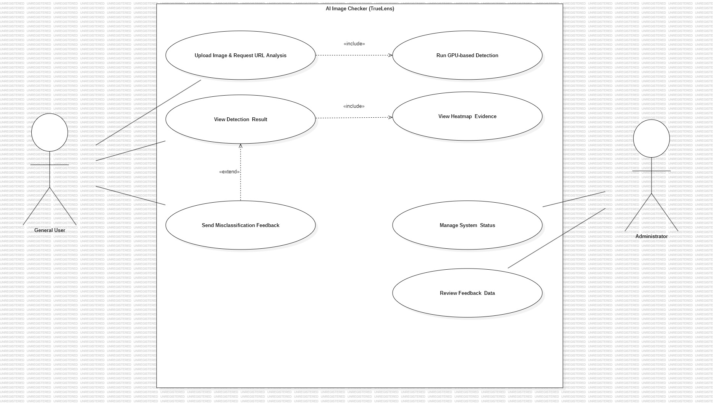
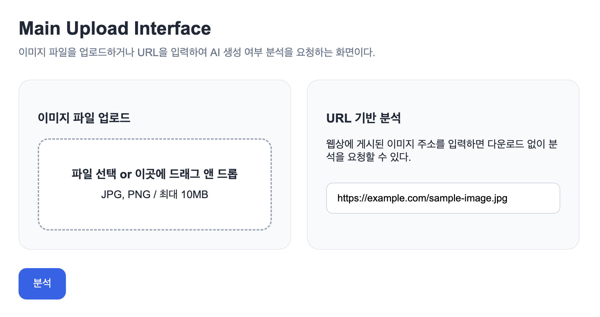
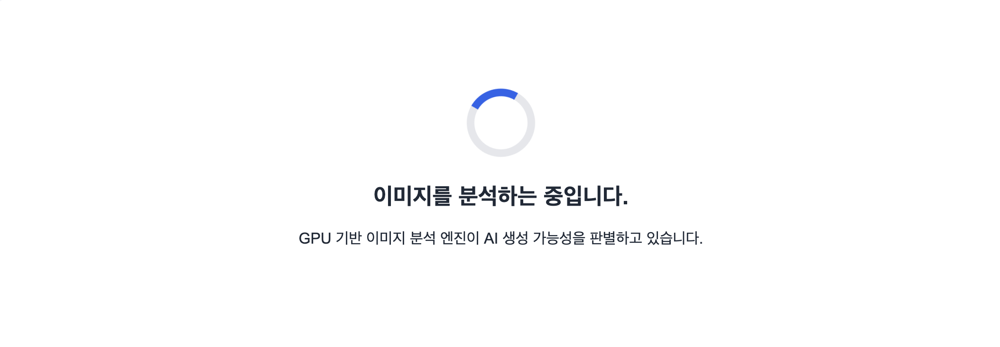
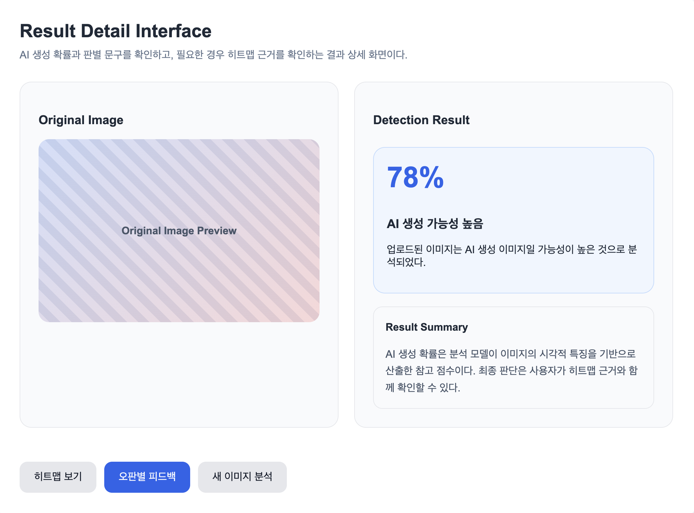
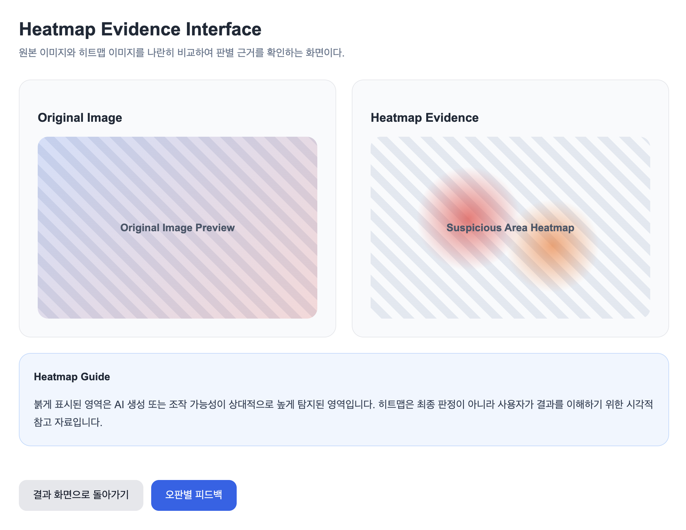
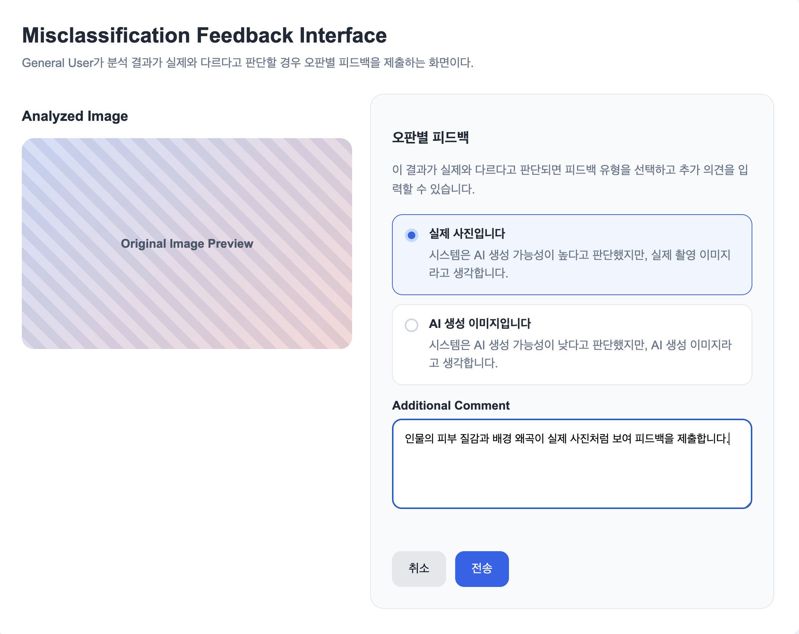
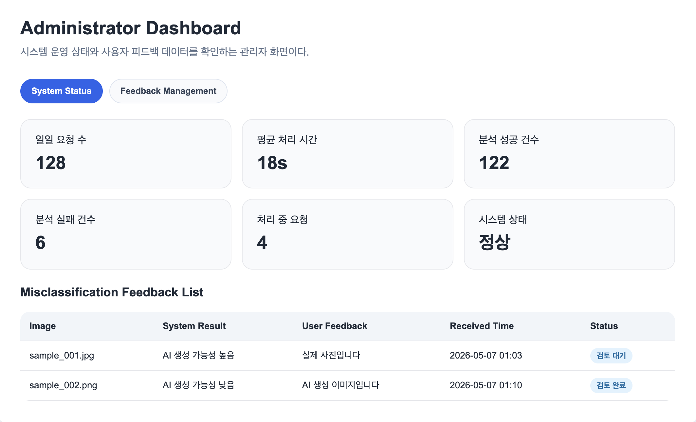
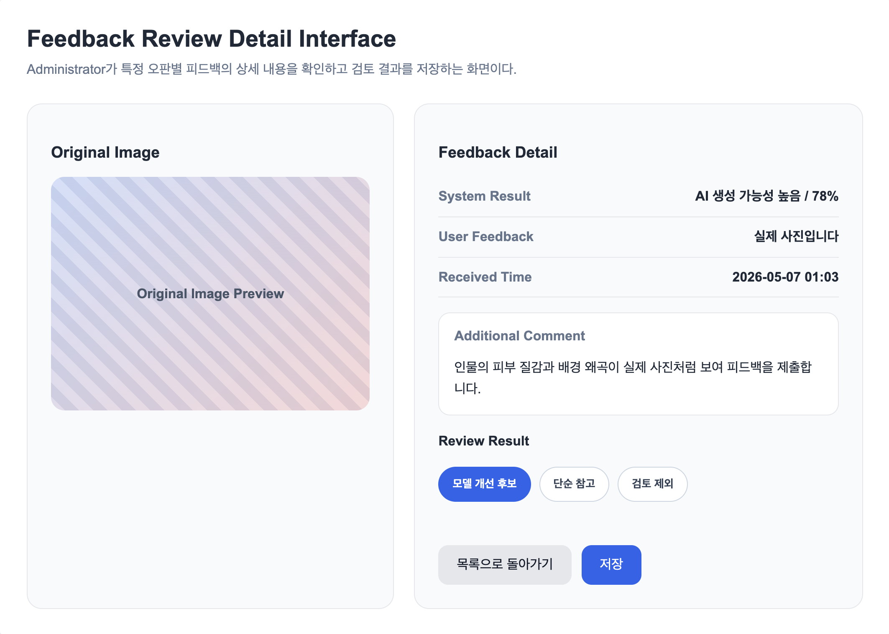

# 2. Analysis

## AI Image Checker
### TrueLens
### AI 생성 이미지 판별 시스템

**Student No, Name, E-mail**
- Student No: 22313526
- Name: 장지웅
- E-mail: jgo030256@gmail.com

---

## [ Revision history ]

| Revision date | Version # | Description | Author |
|---|---:|---|---|
| 04/27/2026 | 0.01 | Analysis document 작성 시작 | 장지웅 |
| 04/27/2026 | 0.02 | Introduction 작성 | 장지웅 |
| 05/4/2026 | 0.03 | Use Case Diagram 작성 | 장지웅 |
| 05/6/2026 | 0.04 | Use Case description 작성 | 장지웅 |
| 05/7/2026 | 0.05 | User Interface prototype 1차 작성 | 장지웅 |
| 05/7/2026 | 0.06 | User Interface prototype 2차 작성 | 장지웅 |
| 05/7/2026 | 0.1 | 1차 완성 | 장지웅 |
| 05/7/2026 | 0.2 | 2차 완성 | 장지웅 |
| 05/8/2026 | 1.0 | 최종 완성 | 장지웅 |

---

## = Contents =

1. Introduction  
2. Use case analysis  
3. Domain analysis  
4. User Interface prototype  
5. Glossary  
6. References  

---

# 1. Introduction

## 1) Summary

AI Image Checker는 사용자가 업로드한 이미지 파일 또는 웹상에 게시된 이미지 URL을 분석하여 해당 이미지가 생성형 AI에 의해 만들어졌을 가능성을 판별하는 GPU 기반 이미지 검증 보조 시스템이다. 최근 생성형 AI 기술의 발전으로 인해 실제 사진과 구별하기 어려운 합성 이미지가 빠르게 확산되고 있으며, 이에 따라 온라인 환경에서 이미지의 신뢰성을 확인하는 과정이 점점 중요해지고 있다.

본 시스템은 단순히 이미지가 AI로 생성되었는지 여부만을 알려주는 것이 아니라, AI 생성 확률과 함께 조작 또는 합성 흔적이 의심되는 영역을 히트맵 형태로 시각화하여 제공한다. 이를 통해 사용자는 결과 수치뿐만 아니라 판별 근거를 함께 확인할 수 있으며, 시스템의 판단 과정을 보다 직관적으로 이해할 수 있다. 또한 시스템의 판별 결과가 실제와 다르다고 판단될 경우, 사용자는 오판별 피드백을 전송할 수 있다. 관리자는 이러한 피드백을 검토하고 향후 모델 재학습 데이터로 분류함으로써 시스템의 지속적인 성능 개선에 활용할 수 있다.

이번 Analysis 문서에서는 AI Image Checker 시스템이 제공해야 할 주요 기능을 Use case 중심으로 분석하고, 시스템을 구성하는 주요 도메인 클래스와 그 의미를 정리한다. 또한 사용자가 실제로 시스템을 이용하는 흐름을 고려하여 주요 사용자 인터페이스 화면을 제안하고, 문서에서 사용되는 주요 용어를 정리한다.

## 2) Describe the features of project

AI Image Checker의 주요 기능은 이미지 업로드, URL 기반 이미지 분석 요청, 분석 결과 확인, 오판별 피드백 전송, 관리자 시스템 및 피드백 관리로 구성된다. 일반 사용자는 로컬 디바이스에 저장된 이미지 파일을 업로드하거나, 웹상에 게시된 이미지 URL을 입력하여 분석을 요청할 수 있다. 시스템은 입력된 이미지를 GPU 기반 분석 엔진으로 전달하고, 이미지의 시각적 특징을 분석하여 AI 생성 가능성을 산출한다.

분석 결과 화면에서는 AI 생성 확률이 수치로 제공되며, 조작이나 합성 흔적이 의심되는 영역은 히트맵으로 표시된다. 이러한 방식은 단순한 결과 제공을 넘어 사용자가 판별 근거를 시각적으로 확인할 수 있게 한다는 점에서 설명 가능성을 가진다. 또한 사용자는 결과가 실제와 다르다고 판단될 경우, 해당 이미지를 실제 사진 또는 가짜 이미지로 피드백할 수 있다. 이 피드백은 관리자에 의해 검토되며, 향후 모델 성능 개선을 위한 데이터로 활용될 수 있다.

관리자는 시스템의 일일 분석 요청 수, 평균 처리 시간, 접수된 피드백 목록 등을 확인할 수 있다. 이를 통해 시스템의 운영 상태를 모니터링하고, 오판별 사례를 검토하여 모델 개선 방향을 판단할 수 있다. 본 프로젝트는 기능 범위를 정지 이미지 분석으로 제한하며, 댓글, 게시판, 프로필과 같은 커뮤니티 기능이나 동영상 딥페이크 실시간 분석 기능은 포함하지 않는다. 이는 과제 범위 내에서 핵심 기능인 이미지 검증과 설명 가능한 분석 결과 제공에 집중하기 위함이다.

AI Image Checker는 다음과 같은 특징을 가진다.

- GPU 기반 이미지 분석을 통해 빠른 판별 처리를 목표로 한다.
- 이미지 파일뿐만 아니라 URL 입력을 통해서도 분석을 요청할 수 있다.
- AI 생성 확률과 히트맵을 함께 제공하여 결과의 설명 가능성을 높인다.
- 사용자의 오판별 피드백을 수집하여 향후 모델 개선에 활용할 수 있다.
- 정지 이미지 분석에 집중하여 프로젝트 범위를 현실적으로 제한한다.

---

# 2. Use case analysis

## 2.1 Use case diagram

아래의 그림은 AI Image Checker(TrueLens) 시스템의 Use Case Diagram을 나타낸 것이다. 본 시스템의 Actor는 이미지를 업로드하고 결과를 확인하는 General User와 시스템 운영 및 피드백 데이터를 관리하는 Administrator로 구분된다. General User는 이미지 파일 또는 URL을 통해 분석을 요청하고, 분석 결과와 히트맵을 확인하며, 필요할 경우 오판별 피드백을 전송한다. Administrator는 시스템 운영 상태와 사용자가 제출한 피드백 데이터를 관리한다.

[그림 2-1] AI Image Checker(TrueLens) Use Case Diagram

## 2.2 Use case description

- 2.2.1 Upload Image & Request URL Analysis
- 2.2.2 Run GPU-based Detection
- 2.2.3 View Detection Result
- 2.2.4 View Heatmap Evidence
- 2.2.5 Send Misclassification Feedback
- 2.2.6 Manage System Status
- 2.2.7 Review Feedback Data

## 2.2.1 Upload Image & Request URL Analysis

Use Case #1 : Upload Image & Request URL Analysis

### GENERAL CHARACTERISTICS

| Item | Description |
|---|---|
| Summary | General User가 AI 생성 여부를 확인하고자 하는 이미지를 시스템에 제출하여 분석을 요청하는 기능이다. 사용자는 로컬 디바이스의 이미지 파일을 업로드하거나 웹상에 게시된 이미지 URL을 입력할 수 있으며, 시스템은 입력된 파일 또는 URL의 유효성을 확인한 뒤 정상적인 경우 분석 요청으로 등록한다. 지원하지 않는 파일 형식이거나 URL 접근에 실패한 경우에는 오류 메시지를 제공하고 다시 입력할 수 있도록 한다. |
| Scope | AI Image Checker(TrueLens) |
| Level | User level |
| Author | 장지웅 |
| Last Update | 04/27/2026 |
| Status | Analysis |
| Primary Actor | General User |
| Secondary Actor | None |
| Preconditions | AI Image Checker 시스템이 정상적으로 실행 중이어야 하며, General User는 메인 업로드 화면에 접근할 수 있어야 한다. 또한 시스템은 이미지 파일 업로드 또는 URL 입력을 받을 수 있는 상태여야 한다. |
| Trigger | General User가 메인 업로드 화면에서 이미지 파일을 선택하거나 URL을 입력한 뒤, “분석” 버튼을 클릭한다. |
| Success Post Condition | 시스템은 입력된 이미지 또는 URL 정보를 정상적으로 수신하고, 고유한 분석 요청 ID를 생성한다. 생성된 분석 요청은 처리 대기 상태 또는 분석 진행 상태로 등록되며, 이후 GPU 기반 분석 단계로 전달될 수 있는 상태가 된다. |
| Failed Post Condition | 지원하지 않는 파일 형식이 입력되거나, URL 형식이 올바르지 않거나, 이미지 데이터를 불러올 수 없는 경우 분석 요청은 생성되지 않는다. 시스템은 General User에게 실패 원인을 안내하고, 사용자가 다시 이미지 파일 또는 URL을 입력할 수 있는 상태를 제공한다. |

### MAIN SUCCESS SCENARIO

| Step | Action |
|---|---|
| S | 이 Use Case는 General User가 AI 생성 여부를 확인하고자 하는 이미지 파일 또는 이미지 URL을 시스템에 입력하여 분석을 요청할 때 시작된다. |
| 1 | General User는 AI Image Checker(TrueLens)의 메인 업로드 화면에 접근한다. |
| 2 | 시스템은 메인 업로드 화면에 파일 업로드 영역을 표시한다. |
| 3 | 시스템은 메인 업로드 화면에 URL 입력창을 표시한다. |
| 4 | 시스템은 메인 업로드 화면에 “분석” 버튼을 표시한다. |
| 5 | General User는 파일 업로드 방식을 선택한다. |
| 6 | General User는 “파일 선택” 버튼을 클릭하거나 파일 업로드 영역에 이미지를 드래그 앤 드롭하여 로컬 디바이스의 이미지 파일을 선택한다. |
| 7 | 시스템은 선택된 이미지 파일명을 메인 업로드 화면에 표시한다. |
| 8 | General User는 화면에 표시된 이미지 파일명을 확인한다. |
| 9 | General User는 “분석” 버튼을 클릭한다. |
| 10 | 시스템은 선택된 이미지 파일을 불러올 수 있는지 확인한다. |
| 11 | 시스템은 입력된 이미지 파일이 지원 가능한 이미지 형식이며, 시스템의 용량 제한을 초과하지 않는지 확인한다. |
| 12 | 시스템은 입력된 이미지 파일을 분석 요청으로 등록한다. |
| 13 | 시스템은 분석 요청 상태를 “분석 중”으로 표시한다. |
| 14 | 시스템은 General User에게 분석 진행 화면을 표시한다. |
| 15 | 시스템은 분석 진행 화면에 “이미지를 분석하는 중입니다.”라는 안내 문구를 표시한다. |
| 16 | 시스템은 분석 진행 화면에 로딩 스피너를 표시한다. |
| 17 | 이 Use Case는 분석 요청이 정상적으로 등록되고 분석 진행 화면이 표시되면 종료된다. |

### EXTENSION SCENARIOS

#### 5a. General User가 파일 업로드 방식 대신 URL 입력 방식으로 분석 대상을 입력하는 경우
#### 9a. 분석 대상이 입력되지 않은 경우
#### 9b. 이미지 파일과 URL이 동시에 입력된 경우
#### 10a. 시스템이 선택된 이미지 파일을 불러올 수 없는 경우
#### 11a. 입력된 이미지 파일이 지원 가능한 이미지 형식이 아닌 경우
#### 11b. 입력된 이미지 파일의 용량이 시스템 제한을 초과한 경우
#### 12a. 시스템이 분석 요청을 등록하지 못한 경우

#### 5a. General User가 파일 업로드 방식 대신 URL 입력 방식으로 분석 대상을 입력하는 경우

이 확장 시나리오는 Main Success Scenario의 Step 5에서 이미지 파일 업로드 대신 URL 입력 방식이 선택되는 경우를 나타낸다. URL 형식 오류 또는 URL 이미지 로드 실패는 본 시나리오 내부의 세부 예외 흐름으로 처리한다.

| Step | Branching Action |
|---|---|
| **5a** | **General User가 파일 업로드 방식 대신 URL 입력 방식으로 분석 대상을 입력하는 경우** |
| 5a1 | General User는 URL 입력창에 분석하고자 하는 이미지 주소를 입력한다. |
| 5a2 | 시스템은 입력된 URL 주소를 URL 입력창 아래에 표시한다. |
| 5a3 | General User는 화면에 표시된 URL 주소를 확인한다. |
| 5a4 | General User는 “분석” 버튼을 클릭한다. |
| 5a5 | 시스템은 입력된 URL이 비어 있지 않은지 확인한다. |
| 5a6 | 시스템은 입력된 URL이 이미지 주소 형식으로 작성되었는지 확인한다. |
| **5a6a** | **입력된 URL 형식이 올바르지 않은 경우** |
| 5a6a1 | 시스템은 화면 중앙에 URL 형식 오류 팝업을 표시한다. |
| 5a6a2 | 시스템은 팝업에 “올바른 이미지 URL을 입력해 주세요.”라는 메시지를 표시한다. |
| 5a6a3 | 시스템은 팝업에 “확인” 버튼을 표시한다. |
| 5a6a4 | General User는 “확인” 버튼을 클릭한다. |
| 5a6a5 | 시스템은 URL 형식 오류 팝업을 닫는다. |
| 5a6a6 | 시스템은 기존 URL 입력값을 유지한다. |
| 5a6a7 | 시스템은 URL 입력창에 포커스를 둔다. |
| 5a6a8 | General User는 URL을 수정하거나 삭제할 수 있다. |
| 5a7 | 시스템은 해당 URL에서 이미지를 불러올 수 있는지 확인한다. |
| **5a7a** | **URL 형식은 올바르지만 해당 URL에서 이미지를 불러올 수 없는 경우** |
| 5a7a1 | 시스템은 화면 중앙에 이미지 로드 실패 팝업을 표시한다. |
| 5a7a2 | 시스템은 팝업에 “해당 URL에서 이미지를 불러올 수 없습니다. 다른 이미지 URL을 입력해 주세요.”라는 메시지를 표시한다. |
| 5a7a3 | 시스템은 팝업에 “확인” 버튼을 표시한다. |
| 5a7a4 | General User는 “확인” 버튼을 클릭한다. |
| 5a7a5 | 시스템은 이미지 로드 실패 팝업을 닫는다. |
| 5a7a6 | 시스템은 기존 URL 입력값을 유지한다. |
| 5a7a7 | 시스템은 URL 입력창에 포커스를 둔다. |
| 5a7a8 | General User는 URL을 수정하거나 삭제할 수 있다. |
| 5a8 | 시스템은 URL 이미지를 분석 요청으로 등록한다. |
| 5a9 | URL 기반 분석 요청이 정상적으로 등록되면 이후 흐름은 Main Success Scenario의 Step 12부터 Step 16까지 동일하게 진행된다. |

#### 9a. 분석 대상이 입력되지 않은 경우

이 확장 시나리오는 Main Success Scenario의 Step 9에서 General User가 “분석” 버튼을 클릭했지만, 시스템이 분석 대상이 되는 이미지 파일 또는 URL을 확인하지 못한 경우를 나타낸다.

| Step | Branching Action |
|---|---|
| **9a** | **분석 대상이 입력되지 않은 경우** |
| 9a1 | 시스템은 화면 중앙에 경고 팝업을 표시한다. |
| 9a2 | 시스템은 팝업에 “이미지 파일을 업로드하거나 URL을 입력해 주세요.”라는 메시지를 표시한다. |
| 9a3 | 시스템은 팝업에 “확인” 버튼을 표시한다. |
| 9a4 | General User는 “확인” 버튼을 클릭한다. |
| 9a5 | 시스템은 경고 팝업을 닫는다. |
| 9a6 | 시스템은 파일 업로드 영역과 URL 입력창을 다시 입력 가능한 상태로 표시한다. |

#### 9b. 이미지 파일과 URL이 동시에 입력된 경우

이 확장 시나리오는 Main Success Scenario의 Step 9에서 General User가 “분석” 버튼을 클릭한 뒤, 시스템이 이미지 파일과 URL이 동시에 입력된 상태를 확인한 경우를 나타낸다.

| Step | Branching Action |
|---|---|
| **9b** | **이미지 파일과 URL이 동시에 입력된 경우** |
| 9b1 | 시스템은 화면 중앙에 입력 오류 팝업을 표시한다. |
| 9b2 | 시스템은 팝업에 “이미지 파일과 URL을 동시에 입력할 수 없습니다. 하나의 방식만 선택해 주세요.”라는 메시지를 표시한다. |
| 9b3 | 시스템은 팝업에 “확인” 버튼을 표시한다. |
| 9b4 | General User는 “확인” 버튼을 클릭한다. |
| 9b5 | 시스템은 입력 오류 팝업을 닫는다. |
| 9b6 | 시스템은 기존에 선택된 이미지 파일과 URL 입력값을 초기화한다. |
| 9b7 | 시스템은 파일 업로드 영역과 URL 입력창을 다시 입력 가능한 상태로 표시한다. |
| 9b8 | General User는 이미지 파일 또는 URL 중 하나의 방식만 선택하여 다시 입력할 수 있다. |

#### 10a. 시스템이 선택된 이미지 파일을 불러올 수 없는 경우

이 확장 시나리오는 Main Success Scenario의 Step 10에서 General User가 선택한 이미지 파일 정보를 확인했으나, 시스템이 해당 파일을 실제 분석 대상으로 불러오지 못하는 경우를 나타낸다.

| Step | Branching Action |
|---|---|
| **10a** | **시스템이 선택된 이미지 파일을 불러올 수 없는 경우** |
| 10a1 | 시스템은 화면 중앙에 파일 불러오기 실패 팝업을 표시한다. |
| 10a2 | 시스템은 팝업에 “선택한 이미지 파일을 불러올 수 없습니다. 파일을 다시 선택해 주세요.”라는 메시지를 표시한다. |
| 10a3 | 시스템은 팝업에 “확인” 버튼을 표시한다. |
| 10a4 | General User는 “확인” 버튼을 클릭한다. |
| 10a5 | 시스템은 파일 불러오기 실패 팝업을 닫는다. |
| 10a6 | 시스템은 기존 파일 선택 상태를 초기화한다. |
| 10a7 | 시스템은 파일 업로드 영역과 URL 입력창을 다시 입력 가능한 상태로 표시한다. |
| 10a8 | General User는 이미지 파일을 다시 선택하거나 URL을 입력할 수 있다. |

#### 11a. 입력된 이미지 파일이 지원 가능한 이미지 형식이 아닌 경우

이 확장 시나리오는 Main Success Scenario의 Step 11에서 업로드된 파일이 JPG 또는 PNG와 같은 지원 가능한 이미지 형식이 아닌 경우를 나타낸다.

| Step | Branching Action |
|---|---|
| **11a** | **입력된 이미지 파일이 지원 가능한 이미지 형식이 아닌 경우** |
| 11a1 | 시스템은 화면 중앙에 파일 형식 오류 팝업을 표시한다. |
| 11a2 | 시스템은 팝업에 “지원하지 않는 이미지 형식입니다. JPG 또는 PNG 파일을 업로드해 주세요.”라는 메시지를 표시한다. |
| 11a3 | 시스템은 팝업에 “확인” 버튼을 표시한다. |
| 11a4 | General User는 “확인” 버튼을 클릭한다. |
| 11a5 | 시스템은 파일 형식 오류 팝업을 닫는다. |
| 11a6 | 시스템은 선택된 파일을 분석 대상으로 등록하지 않는다. |
| 11a7 | 시스템은 파일 업로드 영역을 초기화한다. |
| 11a8 | 시스템은 General User가 다시 이미지 파일을 선택할 수 있도록 한다. |

#### 11b. 입력된 이미지 파일의 용량이 시스템 제한을 초과한 경우

이 확장 시나리오는 Main Success Scenario의 Step 11에서 업로드된 이미지 파일의 용량이 시스템 제한을 초과한 경우를 나타낸다.

| Step | Branching Action |
|---|---|
| **11b** | **입력된 이미지 파일의 용량이 시스템 제한을 초과한 경우** |
| 11b1 | 시스템은 화면 중앙에 용량 초과 팝업을 표시한다. |
| 11b2 | 시스템은 팝업에 “이미지 파일 용량이 너무 큽니다. 10MB 이하의 이미지를 업로드해 주세요.”라는 메시지를 표시한다. |
| 11b3 | 시스템은 팝업에 “확인” 버튼을 표시한다. |
| 11b4 | General User는 “확인” 버튼을 클릭한다. |
| 11b5 | 시스템은 용량 초과 팝업을 닫는다. |
| 11b6 | 시스템은 선택된 파일을 분석 대상으로 등록하지 않는다. |
| 11b7 | 시스템은 파일 업로드 영역을 초기화한다. |
| 11b8 | 시스템은 General User가 다시 이미지 파일을 선택할 수 있도록 한다. |

#### 12a. 시스템이 분석 요청을 등록하지 못한 경우

이 확장 시나리오는 Main Success Scenario의 Step 12에서 시스템 오류로 인해 분석 요청을 정상적으로 등록하지 못한 경우를 나타낸다.

| Step | Branching Action |
|---|---|
| **12a** | **시스템이 분석 요청을 등록하지 못한 경우** |
| 12a1 | 시스템은 화면 중앙에 요청 등록 실패 팝업을 표시한다. |
| 12a2 | 시스템은 팝업에 “분석 요청을 등록하지 못했습니다. 잠시 후 다시 시도해 주세요.”라는 메시지를 표시한다. |
| 12a3 | 시스템은 팝업에 “확인” 버튼을 표시한다. |
| 12a4 | General User는 “확인” 버튼을 클릭한다. |
| 12a5 | 시스템은 요청 등록 실패 팝업을 닫는다. |
| 12a6 | 시스템은 기존에 입력된 이미지 파일명 또는 URL 주소를 화면에 유지한다. |
| 12a7 | 시스템은 General User가 다시 “분석” 버튼을 클릭할 수 있도록 한다. |

### RELATED INFORMATION

| Item | Description |
|---|---|
| Performance | 이미지 파일 또는 URL 입력 후 분석 요청 등록까지는 일반적인 환경에서 3초 이내에 완료되어야 한다. |
| Frequency | General User가 이미지의 AI 생성 여부를 확인하고자 할 때마다 반복적으로 사용된다. |
| Concurrency | 여러 General User가 동시에 이미지 분석 요청을 생성할 수 있어야 한다. |
| Security | 업로드된 이미지와 URL 정보는 분석 목적 외에 임의로 공개되지 않아야 한다. |
| Constraint | 본 Use Case는 정지 이미지 파일과 이미지 URL만 대상으로 하며, 동영상 파일과 실시간 스트리밍 URL은 포함하지 않는다. |

## 2.2.2 Run GPU-based Detection

Use Case #2 : Run GPU-based Detection

### GENERAL CHARACTERISTICS

| Item | Description |
|---|---|
| Summary | 시스템이 등록된 이미지 분석 요청을 처리하여 이미지의 AI 생성 가능성을 판별하는 기능이다. 이 Use Case는 Upload Image & Request URL Analysis Use Case에 의해 포함되는 기능이며, 시스템은 입력된 이미지를 분석 가능한 상태로 준비한 뒤 GPU 기반 분석 과정을 수행한다. 분석이 정상적으로 완료되면 AI 생성 가능성 점수와 히트맵 생성을 위한 분석 결과가 생성된다. |
| Scope | AI Image Checker(TrueLens) |
| Level | System level |
| Author | 장지웅 |
| Last Update | 04/27/2026 |
| Status | Analysis |
| Primary Actor | System |
| Secondary Actor | None |
| Preconditions | 분석 요청이 정상적으로 등록되어 있어야 하며, 분석 대상 이미지가 시스템에서 불러올 수 있는 상태여야 한다. 또한 시스템은 이미지 분석 기능을 실행할 수 있는 상태여야 한다. |
| Trigger | Upload Image & Request URL Analysis Use Case에서 분석 요청이 정상적으로 등록된 후, 시스템이 해당 요청을 분석 대상으로 전달한다. |
| Success Post Condition | 시스템은 이미지에 대한 AI 생성 가능성 점수를 생성하고, 분석 결과를 저장 가능한 상태로 만든다. 또한 이후 View Detection Result Use Case에서 결과를 조회할 수 있도록 분석 완료 상태를 등록한다. |
| Failed Post Condition | 이미지 분석이 실패한 경우 시스템은 해당 요청을 분석 실패 상태로 등록한다. 분석 결과 점수는 생성되지 않으며, 사용자는 결과 화면에서 분석 실패 안내를 확인할 수 있다. |

### MAIN SUCCESS SCENARIO

| Step | Action |
|---|---|
| S | 이 Use Case는 시스템이 등록된 이미지 분석 요청을 처리하기 시작할 때 시작된다. |
| 1 | 시스템은 처리 대기 상태의 분석 요청을 확인한다. |
| 2 | 시스템은 분석 대상 이미지를 불러온다. |
| 3 | 시스템은 이미지가 분석 가능한 상태인지 확인한다. |
| 4 | 시스템은 이미지 분석 기능을 실행한다. |
| 5 | 시스템은 이미지의 AI 생성 가능성을 계산한다. |
| 6 | 시스템은 AI 생성 가능성 점수를 생성한다. |
| 7 | 시스템은 히트맵 생성을 위한 분석 정보를 생성한다. |
| 8 | 시스템은 분석 요청 상태를 “분석 완료”로 변경한다. |
| 9 | 시스템은 분석 결과를 저장한다. |
| 10 | 이 Use Case는 분석 결과가 저장되고 결과 조회가 가능한 상태가 되면 종료된다. |

### EXTENSION SCENARIOS

#### 2a. 분석 대상 이미지를 불러올 수 없는 경우

이 확장 시나리오는 Main Success Scenario의 Step 2에서 시스템이 분석 대상 이미지를 불러오지 못하는 경우를 나타낸다.

| Step | Branching Action |
|---|---|
| **2a** | **분석 대상 이미지를 불러올 수 없는 경우** |
| 2a1 | 시스템은 분석 대상 이미지를 불러오지 못했음을 확인한다. |
| 2a2 | 시스템은 해당 분석 요청 상태를 “분석 실패”로 변경한다. |
| 2a3 | 시스템은 실패 원인을 “이미지 불러오기 실패”로 기록한다. |
| 2a4 | 시스템은 이후 사용자가 결과 화면에서 실패 안내를 확인할 수 있도록 실패 정보를 저장한다. |

#### 3a. 이미지가 분석 가능한 상태가 아닌 경우

이 확장 시나리오는 Main Success Scenario의 Step 3에서 이미지 파일이 손상되었거나 분석 가능한 이미지로 확인되지 않는 경우를 나타낸다.

| Step | Branching Action |
|---|---|
| **3a** | **이미지가 분석 가능한 상태가 아닌 경우** |
| 3a1 | 시스템은 이미지가 분석 가능한 상태가 아님을 확인한다. |
| 3a2 | 시스템은 해당 분석 요청 상태를 “분석 실패”로 변경한다. |
| 3a3 | 시스템은 실패 원인을 “이미지 분석 불가”로 기록한다. |
| 3a4 | 시스템은 실패 정보를 저장한다. |

#### 4a. 이미지 분석 기능을 실행할 수 없는 경우

이 확장 시나리오는 Main Success Scenario의 Step 4에서 시스템이 이미지 분석 기능을 정상적으로 실행하지 못하는 경우를 나타낸다.

| Step | Branching Action |
|---|---|
| **4a** | **이미지 분석 기능을 실행할 수 없는 경우** |
| 4a1 | 시스템은 이미지 분석 기능을 실행할 수 없음을 확인한다. |
| 4a2 | 시스템은 해당 분석 요청 상태를 “분석 실패”로 변경한다. |
| 4a3 | 시스템은 실패 원인을 “분석 기능 실행 실패”로 기록한다. |
| 4a4 | 시스템은 실패 정보를 저장한다. |

#### 6a. AI 생성 가능성 점수를 생성하지 못한 경우

이 확장 시나리오는 Main Success Scenario의 Step 6에서 시스템이 AI 생성 가능성 점수를 정상적으로 생성하지 못하는 경우를 나타낸다.

| Step | Branching Action |
|---|---|
| **6a** | **AI 생성 가능성 점수를 생성하지 못한 경우** |
| 6a1 | 시스템은 AI 생성 가능성 점수가 생성되지 않았음을 확인한다. |
| 6a2 | 시스템은 해당 분석 요청 상태를 “분석 실패”로 변경한다. |
| 6a3 | 시스템은 실패 원인을 “점수 생성 실패”로 기록한다. |
| 6a4 | 시스템은 실패 정보를 저장한다. |

### RELATED INFORMATION

| Item | Description |
|---|---|
| Performance | 일반적인 이미지 1장에 대한 분석 결과는 가능한 한 짧은 시간 안에 생성되어야 하며 최대 1분을 넘지 않도록 한다. |
| Frequency | General User가 이미지 분석을 요청할 때마다 실행된다. |
| Concurrency | 여러 분석 요청이 동시에 발생할 수 있으므로 시스템은 요청 상태를 구분하여 처리할 수 있어야 한다. |
| Reliability | 분석 실패가 발생하더라도 시스템은 비정상 종료되지 않고 실패 상태와 원인을 기록해야 한다. |
| Constraint | 본 Use Case는 정지 이미지 분석만 대상으로 하며, 동영상 프레임 분석이나 실시간 스트리밍 분석은 포함하지 않는다. |

## 2.2.3 View Detection Result

Use Case #3 : View Detection Result

### GENERAL CHARACTERISTICS

| Item | Description |
|---|---|
| Summary | General User가 이미지 분석이 완료된 후 AI 생성 가능성 결과를 확인하는 기능이다. 시스템은 Result Detail Interface에서 원본 이미지, AI 생성 확률, 판별 문구, 결과 요약 정보, “히트맵 보기” 버튼, “오판별 피드백” 버튼, “새 이미지 분석” 버튼을 제공한다. 분석 결과가 정상적으로 존재하는 경우 General User는 해당 이미지가 AI 생성 이미지일 가능성이 높은지 낮은지를 확인할 수 있으며, 필요할 경우 히트맵 근거 확인, 오판별 피드백 전송, 새로운 이미지 분석으로 이어갈 수 있다. 분석이 실패했거나 결과를 불러올 수 없는 경우 시스템은 실패 원인을 안내한다. |
| Scope | AI Image Checker(TrueLens) |
| Level | User level |
| Author | 장지웅 |
| Last Update | 04/27/2026 |
| Status | Analysis |
| Primary Actor | General User |
| Secondary Actor | None |
| Preconditions | 이미지 분석 요청이 정상적으로 등록되어 있어야 하며, 해당 요청에 대한 분석 결과가 생성되어 있거나 분석 상태를 조회할 수 있어야 한다. |
| Trigger | 분석이 완료된 후 시스템이 Result Detail Interface로 전환한다. |
| Success Post Condition | 시스템은 General User에게 원본 이미지, AI 생성 확률, 판별 결과 문구, 결과 요약 정보, “히트맵 보기” 버튼, “오판별 피드백” 버튼, “새 이미지 분석” 버튼을 표시한다. General User는 분석 결과를 확인하고 필요할 경우 히트맵 근거 확인, 오판별 피드백 전송, 새로운 이미지 분석으로 이어갈 수 있다. |
| Failed Post Condition | 분석 결과가 존재하지 않거나 분석이 실패한 경우 시스템은 결과 상세 정보를 표시하지 않는다. 대신 General User에게 결과 조회 실패 또는 분석 실패 안내를 제공한다. |

### MAIN SUCCESS SCENARIO

| Step | Action |
|---|---|
| S | 이 Use Case는 General User가 분석이 완료된 이미지의 판별 결과를 확인하려고 할 때 시작된다. |
| 1 | 분석이 완료되면 시스템은 Result Detail Interface로 전환한다. |
| 2 | 시스템은 General User가 요청한 분석 결과 정보를 확인한다. |
| 3 | 시스템은 해당 분석 요청의 상태가 “분석 완료”인지 확인한다. |
| 4 | 시스템은 Result Detail Interface를 표시한다. |
| 5 | 시스템은 Result Detail Interface에 원본 이미지를 표시한다. |
| 6 | 시스템은 Result Detail Interface에 AI 생성 확률을 백분율 형태로 표시한다. |
| 7 | 시스템은 AI 생성 확률에 따라 “AI 생성 가능성 낮음”, “AI 생성 가능성 보통”, “AI 생성 가능성 높음” 중 하나의 판별 문구를 표시한다. |
| 8 | 시스템은 Result Detail Interface에 결과 요약 정보를 표시한다. |
| 9 | 시스템은 Result Detail Interface에 “히트맵 보기” 버튼을 표시한다. |
| 10 | 시스템은 Result Detail Interface에 “오판별 피드백” 버튼을 표시한다. |
| 11 | 시스템은 Result Detail Interface에 “새 이미지 분석” 버튼을 표시한다. |
| 12 | General User는 원본 이미지, AI 생성 확률, 판별 문구, 결과 요약 정보를 확인한다. |
| 13 | 이 Use Case는 General User가 분석 결과를 확인하면 종료된다. |

### EXTENSION SCENARIOS

#### 2a. 분석 결과 정보를 찾을 수 없는 경우

이 확장 시나리오는 Main Success Scenario의 Step 2에서 시스템이 분석 완료 후 표시해야 할 분석 결과 정보를 찾지 못하는 경우를 나타낸다.

| Step | Branching Action |
|---|---|
| **2a** | **분석 결과 정보를 찾을 수 없는 경우** |
| 2a1 | 시스템은 화면 중앙에 결과 조회 실패 팝업을 표시한다. |
| 2a2 | 시스템은 팝업에 “분석 결과를 찾을 수 없습니다. 다시 분석을 요청해 주세요.”라는 메시지를 표시한다. |
| 2a3 | 시스템은 팝업에 “확인” 버튼을 표시한다. |
| 2a4 | General User는 “확인” 버튼을 클릭한다. |
| 2a5 | 시스템은 결과 조회 실패 팝업을 닫는다. |
| 2a6 | 시스템은 General User를 메인 업로드 화면으로 이동시킨다. |

#### 3a. 분석이 아직 완료되지 않은 경우

이 확장 시나리오는 Main Success Scenario의 Step 3에서 분석 요청 상태가 아직 “분석 중”인 경우를 나타낸다.

| Step | Branching Action |
|---|---|
| **3a** | **분석이 아직 완료되지 않은 경우** |
| 3a1 | 시스템은 분석 진행 화면을 계속 표시한다. |
| 3a2 | 시스템은 화면에 “이미지를 분석하는 중입니다.”라는 안내 문구를 표시한다. |
| 3a3 | 시스템은 로딩 스피너를 표시한다. |
| 3a4 | 분석이 완료되면 시스템은 Main Success Scenario의 Step 4로 이동한다. |

#### 3b. 분석이 실패한 경우

이 확장 시나리오는 Main Success Scenario의 Step 3에서 분석 요청 상태가 “분석 실패”로 확인되는 경우를 나타낸다.

| Step | Branching Action |
|---|---|
| **3b** | **분석이 실패한 경우** |
| 3b1 | 시스템은 화면 중앙에 분석 실패 안내 팝업을 표시한다. |
| 3b2 | 시스템은 팝업에 “이미지 분석에 실패했습니다. 다른 이미지를 사용하거나 다시 시도해 주세요.”라는 메시지를 표시한다. |
| 3b3 | 시스템은 팝업에 “다시 분석” 버튼과 “메인으로 이동” 버튼을 표시한다. |
| 3b4 | General User가 “다시 분석” 버튼을 클릭한다. |
| 3b5 | 시스템은 기존 이미지 또는 URL 정보를 유지한 상태로 다시 분석 요청을 시도할 수 있는 화면을 표시한다. |
| 3b6 | General User가 “메인으로 이동” 버튼을 클릭하는 경우, 시스템은 메인 업로드 화면으로 이동한다. |

#### 6a. AI 생성 확률을 표시할 수 없는 경우

이 확장 시나리오는 Main Success Scenario의 Step 6에서 시스템이 AI 생성 확률을 정상적으로 표시하지 못하는 경우를 나타낸다.

| Step | Branching Action |
|---|---|
| **6a** | **AI 생성 확률을 표시할 수 없는 경우** |
| 6a1 | 시스템은 결과 상세 화면에 “AI 생성 확률을 표시할 수 없습니다.”라는 안내 문구를 표시한다. |
| 6a2 | 시스템은 원본 이미지와 분석 상태 정보는 유지하여 표시한다. |
| 6a3 | 시스템은 General User가 다시 분석을 요청할 수 있도록 “다시 분석” 버튼을 표시한다. |

#### 11a. General User가 새 이미지 분석을 요청하는 경우

이 확장 시나리오는 Main Success Scenario의 Step 11에서 General User가 “새 이미지 분석” 버튼을 클릭하여 새로운 이미지 분석을 시작하려는 경우를 나타낸다.

| Step | Branching Action |
|---|---|
| **11a** | **General User가 새 이미지 분석을 요청하는 경우** |
| 11a1 | General User는 “새 이미지 분석” 버튼을 클릭한다. |
| 11a2 | 시스템은 Main Upload Interface를 표시한다. |
| 11a3 | 시스템은 파일 업로드 영역과 URL 입력창을 다시 입력 가능한 상태로 표시한다. |
| 11a4 | General User는 새로운 이미지 파일 또는 URL을 입력할 수 있다. |

### RELATED INFORMATION

| Item | Description |
|---|---|
| Performance | 분석이 완료된 후 Result Detail Interface는 3초 이내에 표시되는 것을 목표로 한다. |
| Frequency | General User가 이미지 분석을 완료한 후 결과를 확인할 때마다 사용된다. |
| Concurrency | 여러 General User가 동시에 각자의 분석 결과를 조회할 수 있어야 한다. |
| Reliability | 분석 결과 일부를 표시하지 못하더라도 시스템은 비정상 종료되지 않고 조회 실패 또는 표시 실패 원인을 안내해야 한다. |
| Security | 분석 결과와 업로드된 이미지는 해당 요청을 생성한 사용자 또는 권한이 있는 관리자만 접근할 수 있어야 한다. |
| Constraint | 본 Use Case는 분석 결과 조회 기능을 다루며, 오판별 피드백 입력 과정은 Send Misclassification Feedback Use Case에서 별도로 다룬다. |

## 2.2.4 View Heatmap Evidence

Use Case #4 : View Heatmap Evidence

### GENERAL CHARACTERISTICS

| Item | Description |
|---|---|
| Summary | General User가 분석 결과 화면에서 AI 생성 또는 조작이 의심되는 이미지 영역을 히트맵 형태로 확인하는 기능이다. 시스템은 원본 이미지와 히트맵 이미지를 비교할 수 있도록 표시하며, General User는 어떤 영역이 판별 근거로 활용되었는지 시각적으로 확인할 수 있다. 히트맵 데이터가 정상적으로 존재하지 않거나 표시할 수 없는 경우 시스템은 해당 사실을 안내한다. |
| Scope | AI Image Checker(TrueLens) |
| Level | User level |
| Author | 장지웅 |
| Last Update | 04/27/2026 |
| Status | Analysis |
| Primary Actor | General User |
| Secondary Actor | None |
| Preconditions | 이미지 분석이 완료되어 있어야 하며, General User는 결과 상세 화면에 접근한 상태여야 한다. 또한 해당 분석 결과에 히트맵 근거 정보가 존재하거나 히트맵 표시 가능 여부를 확인할 수 있어야 한다. |
| Trigger | General User가 Result Detail Interface에서 “히트맵 보기” 버튼을 클릭한다. |
| Success Post Condition | 시스템은 원본 이미지와 히트맵 이미지를 함께 표시한다. General User는 AI 생성 또는 조작 의심 영역을 시각적으로 확인할 수 있다. |
| Failed Post Condition | 히트맵 정보가 존재하지 않거나 표시 과정에서 오류가 발생한 경우 시스템은 히트맵을 표시하지 않는다. 대신 히트맵 근거를 제공할 수 없다는 안내 문구를 표시하고, General User가 Result Detail Interface로 돌아갈 수 있는 상태를 제공한다. |

### MAIN SUCCESS SCENARIO

| Step | Action |
|---|---|
| S | 이 Use Case는 General User가 분석 결과의 시각적 근거를 확인하려고 할 때 시작된다. |
| 1 | General User는 Result Detail Interface에서 “히트맵 보기” 버튼을 클릭한다. |
| 2 | 시스템은 Heatmap Evidence Interface를 표시한다. |
| 3 | 시스템은 해당 분석 결과에 연결된 히트맵 정보가 존재하는지 확인한다. |
| 4 | 시스템은 히트맵 이미지를 불러올 수 있는지 확인한다. |
| 5 | 시스템은 원본 이미지와 히트맵 이미지를 나란히 표시한다. |
| 6 | 시스템은 Heatmap Guide 영역에 “붉게 표시된 영역은 AI 생성 또는 조작 가능성이 상대적으로 높게 탐지된 영역입니다.”라는 안내 문구를 표시한다. |
| 7 | General User는 원본 이미지와 히트맵 이미지를 비교하여 확인한다. |
| 8 | General User는 필요할 경우 “결과 화면으로 돌아가기” 버튼을 클릭한다. |
| 9 | 시스템은 Result Detail Interface를 다시 표시한다. |
| 10 | 이 Use Case는 General User가 히트맵 근거 확인을 완료하면 종료된다. |

### EXTENSION SCENARIOS

#### 3a. 히트맵 정보가 존재하지 않는 경우

이 확장 시나리오는 Main Success Scenario의 Step 3에서 해당 분석 결과에 연결된 히트맵 정보가 존재하지 않는 경우를 나타낸다.

| Step | Branching Action |
|---|---|
| **3a** | **히트맵 정보가 존재하지 않는 경우** |
| 3a1 | 시스템은 히트맵 확인 영역에 안내 문구를 표시한다. |
| 3a2 | 시스템은 “이 분석 결과에는 히트맵 근거 정보가 제공되지 않습니다.”라는 메시지를 표시한다. |
| 3a3 | 시스템은 General User가 AI 생성 확률과 판별 문구를 다시 확인할 수 있도록 “결과 화면으로 돌아가기” 버튼을 표시한다. |

#### 4a. 히트맵 이미지를 불러올 수 없는 경우

이 확장 시나리오는 Main Success Scenario의 Step 4에서 시스템이 히트맵 이미지를 불러오지 못하는 경우를 나타낸다.

| Step | Branching Action |
|---|---|
| **4a** | **히트맵 이미지를 불러올 수 없는 경우** |
| 4a1 | 시스템은 화면 중앙에 히트맵 로드 실패 팝업을 표시한다. |
| 4a2 | 시스템은 팝업에 “히트맵 이미지를 불러올 수 없습니다. 잠시 후 다시 시도해 주세요.”라는 메시지를 표시한다. |
| 4a3 | 시스템은 팝업에 “확인” 버튼을 표시한다. |
| 4a4 | General User는 “확인” 버튼을 클릭한다. |
| 4a5 | 시스템은 히트맵 로드 실패 팝업을 닫는다. |
| 4a6 | 시스템은 Heatmap Evidence Interface를 유지한다. |
| 4a7 | 시스템은 히트맵 영역에 “히트맵을 표시할 수 없습니다.”라는 안내 문구를 표시한다. |

### RELATED INFORMATION

| Item | Description |
|---|---|
| Performance | 히트맵 이미지는 General User가 “히트맵 보기” 버튼을 클릭한 후 3초 이내에 표시되는 것을 목표로 한다. |
| Frequency | General User가 분석 결과의 시각적 근거를 확인하고자 할 때 사용된다. |
| Concurrency | 여러 General User가 동시에 히트맵 근거를 조회할 수 있어야 한다. |
| Reliability | 히트맵 표시 실패가 발생하더라도 결과 상세 화면은 유지되어야 하며, 시스템은 실패 원인을 안내해야 한다. |
| Usability | 히트맵은 일반 사용자도 이해할 수 있도록 원본 이미지와 비교 가능한 형태로 제공되어야 한다. |
| Constraint | 히트맵은 판별 근거를 보조적으로 설명하기 위한 시각 자료이며, 최종적인 진위 판단을 단정하는 정보로 사용되지 않는다. |

## 2.2.5 Send Misclassification Feedback

Use Case #5 : Send Misclassification Feedback

### GENERAL CHARACTERISTICS

| Item | Description |
|---|---|
| Summary | General User가 시스템의 AI 생성 이미지 판별 결과가 실제와 다르다고 판단할 경우 오판별 피드백을 전송하는 기능이다. General User는 결과 상세 화면에서 “오판별 피드백” 버튼을 클릭한 뒤, 해당 이미지가 실제 사진인지 또는 AI 생성 이미지인지 선택하고 필요한 경우 추가 의견을 입력할 수 있다. 시스템은 입력된 피드백을 저장하고 관리자 검토 대상 데이터로 등록한다. |
| Scope | AI Image Checker(TrueLens) |
| Level | User level |
| Author | 장지웅 |
| Last Update | 04/27/2026 |
| Status | Analysis |
| Primary Actor | General User |
| Secondary Actor | None |
| Preconditions | General User는 분석 결과 상세 화면에 접근한 상태여야 하며, 해당 분석 결과가 시스템에 정상적으로 존재해야 한다. 또한 시스템은 사용자 피드백을 입력받고 저장할 수 있는 상태여야 한다. |
| Trigger | General User가 결과 상세 화면에서 “오판별 피드백” 버튼을 클릭한다. |
| Success Post Condition | 시스템은 General User가 제출한 오판별 피드백을 저장하고, 해당 피드백을 관리자 검토 대기 상태로 등록한다. |
| Failed Post Condition | 필수 항목이 누락되거나 피드백 저장에 실패한 경우 시스템은 피드백을 등록하지 않는다. 시스템은 실패 원인을 General User에게 안내하고 다시 입력할 수 있는 상태를 제공한다. |

### MAIN SUCCESS SCENARIO

| Step | Action |
|---|---|
| S | 이 Use Case는 General User가 분석 결과가 실제와 다르다고 판단하여 오판별 피드백을 전송하려고 할 때 시작된다. |
| 1 | General User는 결과 상세 화면에 접근한다. |
| 2 | 시스템은 결과 상세 화면에 “오판별 피드백” 버튼을 표시한다. |
| 3 | General User는 “오판별 피드백” 버튼을 클릭한다. |
| 4 | 시스템은 Misclassification Feedback Interface를 표시한다. |
| 5 | 시스템은 Misclassification Feedback Interface에 분석 대상 이미지를 표시한다. |
| 6 | 시스템은 피드백 유형 선택 항목을 표시한다. |
| 7 | 시스템은 “실제 사진입니다” 선택 항목을 표시한다. |
| 8 | 시스템은 “AI 생성 이미지입니다” 선택 항목을 표시한다. |
| 9 | 시스템은 추가 의견 입력창을 표시한다. |
| 10 | 시스템은 “전송” 버튼과 “취소” 버튼을 표시한다. |
| 11 | General User는 피드백 유형 중 하나를 선택한다. |
| 12 | General User는 필요한 경우 추가 의견 입력창에 의견을 작성한다. |
| 13 | General User는 “전송” 버튼을 클릭한다. |
| 14 | 시스템은 General User가 피드백 유형을 선택했는지 확인한다. |
| 15 | 시스템은 피드백 내용을 해당 분석 결과와 연결한다. |
| 16 | 시스템은 피드백 상태를 “검토 대기”로 등록한다. |
| 17 | 시스템은 화면 중앙에 피드백 접수 완료 팝업을 표시한다. |
| 18 | 시스템은 팝업에 “피드백이 접수되었습니다.”라는 메시지를 표시한다. |
| 19 | 시스템은 팝업에 “확인” 버튼을 표시한다. |
| 20 | General User는 “확인” 버튼을 클릭한다. |
| 21 | 시스템은 피드백 접수 완료 팝업을 닫는다. |
| 22 | 시스템은 General User에게 Result Detail Interface를 다시 표시한다. |
| 23 | 이 Use Case는 오판별 피드백이 정상적으로 저장되고 Result Detail Interface로 돌아가면 종료된다. |

### EXTENSION SCENARIOS

#### 10a. General User가 피드백 전송을 원하지 않는 경우

이 확장 시나리오는 Main Success Scenario의 Step 10 이후 General User가 피드백 입력을 진행하지 않고 결과 상세 화면으로 돌아가는 경우를 나타낸다.

| Step | Branching Action |
|---|---|
| **10a** | **General User가 피드백 전송을 원하지 않는 경우** |
| 10a1 | General User는 Misclassification Feedback Interface에서 “취소” 버튼을 클릭한다. |
| 10a2 | 시스템은 Misclassification Feedback Interface를 닫고 Result Detail Interface를 다시 표시한다. |
| 10a3 | 시스템은 General User에게 결과 상세 화면을 다시 표시한다. |

#### 14a. General User가 피드백 유형을 선택하지 않은 경우

이 확장 시나리오는 Main Success Scenario의 Step 14에서 General User가 “실제 사진입니다” 또는 “AI 생성 이미지입니다” 중 하나를 선택하지 않은 상태로 전송을 시도한 경우를 나타낸다.

| Step | Branching Action |
|---|---|
| **14a** | **General User가 피드백 유형을 선택하지 않은 경우** |
| 14a1 | 시스템은 Misclassification Feedback Interface 안에 경고 메시지를 표시한다. |
| 14a2 | 시스템은 “피드백 유형을 선택해 주세요.”라는 메시지를 표시한다. |
| 14a3 | 시스템은 Misclassification Feedback Interface를 닫지 않고 유지한다. |
| 14a4 | General User는 피드백 유형을 다시 선택할 수 있다. |

#### 15a. 해당 분석 결과와 피드백을 연결할 수 없는 경우

이 확장 시나리오는 Main Success Scenario의 Step 15에서 시스템이 사용자의 피드백을 기존 분석 결과와 연결하지 못하는 경우를 나타낸다.

| Step | Branching Action |
|---|---|
| **15a** | **해당 분석 결과와 피드백을 연결할 수 없는 경우** |
| 15a1 | 시스템은 화면 중앙에 피드백 처리 오류 팝업을 표시한다. |
| 15a2 | 시스템은 팝업에 “분석 결과 정보를 확인할 수 없어 피드백을 접수할 수 없습니다.”라는 메시지를 표시한다. |
| 15a3 | 시스템은 팝업에 “확인” 버튼을 표시한다. |
| 15a4 | General User는 “확인” 버튼을 클릭한다. |
| 15a5 | 시스템은 피드백 처리 오류 팝업을 닫는다. |
| 15a6 | 시스템은 General User에게 결과 상세 화면을 다시 표시한다. |

#### 16a. 시스템이 피드백을 저장하지 못한 경우

이 확장 시나리오는 Main Success Scenario의 Step 16에서 시스템 오류로 인해 오판별 피드백을 정상적으로 저장하지 못하는 경우를 나타낸다.

| Step | Branching Action |
|---|---|
| **16a** | **시스템이 피드백을 저장하지 못한 경우** |
| 16a1 | 시스템은 화면 중앙에 피드백 저장 실패 팝업을 표시한다. |
| 16a2 | 시스템은 팝업에 “피드백을 저장하지 못했습니다. 잠시 후 다시 시도해 주세요.”라는 메시지를 표시한다. |
| 16a3 | 시스템은 팝업에 “확인” 버튼을 표시한다. |
| 16a4 | General User는 “확인” 버튼을 클릭한다. |
| 16a5 | 시스템은 피드백 저장 실패 팝업을 닫는다. |
| 16a6 | 시스템은 General User가 피드백 내용을 다시 전송할 수 있도록 Misclassification Feedback Interface를 유지한다. |

#### 16b. 동일 분석 결과에 대해 이미 피드백이 제출된 경우

이 확장 시나리오는 Main Success Scenario의 Step 16에서 General User가 동일한 분석 결과에 대해 이미 피드백을 제출한 상태인 경우를 나타낸다.

| Step | Branching Action |
|---|---|
| **16b** | **동일 분석 결과에 대해 이미 피드백이 제출된 경우** |
| 16b1 | 시스템은 화면 중앙에 중복 피드백 안내 팝업을 표시한다. |
| 16b2 | 시스템은 팝업에 “이미 해당 분석 결과에 대한 피드백이 접수되었습니다.”라는 메시지를 표시한다. |
| 16b3 | 시스템은 팝업에 “확인” 버튼을 표시한다. |
| 16b4 | General User는 “확인” 버튼을 클릭한다. |
| 16b5 | 시스템은 중복 피드백 안내 팝업을 닫는다. |
| 16b6 | 시스템은 General User에게 결과 상세 화면을 다시 표시한다. |

### RELATED INFORMATION

| Item | Description |
|---|---|
| Performance | General User가 “전송” 버튼을 클릭한 후 피드백 접수 결과는 3초 이내에 표시되는 것을 목표로 한다. |
| Frequency | General User가 분석 결과가 실제와 다르다고 판단할 때 선택적으로 사용된다. |
| Concurrency | 여러 General User가 동시에 오판별 피드백을 제출할 수 있어야 한다. |
| Reliability | 피드백 저장 실패가 발생하더라도 시스템은 비정상 종료되지 않고 실패 원인을 안내해야 한다. |
| Security | 사용자가 제출한 피드백과 분석 결과 정보는 관리자 검토 목적 외에 임의로 공개되지 않아야 한다. |
| Constraint | 본 Use Case는 피드백 제출 기능만 다루며, 관리자가 피드백을 검토하고 모델 개선 데이터로 분류하는 과정은 Review Feedback Data Use Case에서 별도로 다룬다. |

## 2.2.6 Manage System Status

Use Case #6 : Manage System Status

### GENERAL CHARACTERISTICS

| Item | Description |
|---|---|
| Summary | Administrator가 AI Image Checker(TrueLens)의 운영 상태를 확인하고 시스템이 정상적으로 동작하는지 점검하는 기능이다. Administrator는 관리자 대시보드에서 일일 분석 요청 수, 평균 처리 시간, 분석 성공 및 실패 건수, 현재 처리 중인 요청 수를 확인할 수 있다. 시스템은 운영 상태 정보를 시각적으로 제공하며, 오류나 비정상 상태가 있는 경우 관리자에게 이를 안내한다. |
| Scope | AI Image Checker(TrueLens) |
| Level | Admin level |
| Author | 장지웅 |
| Last Update | 04/27/2026 |
| Status | Analysis |
| Primary Actor | Administrator |
| Secondary Actor | None |
| Preconditions | AI Image Checker 시스템이 정상적으로 실행 중이어야 하며, Administrator는 관리자 계정으로 로그인한 상태여야 한다. 또한 시스템은 운영 상태 정보를 조회할 수 있는 상태여야 한다. |
| Trigger | Administrator가 관리자 대시보드에서 System Status 영역에 접근한다. |
| Success Post Condition | 시스템은 Administrator에게 분석 요청 통계, 평균 처리 시간, 분석 성공 및 실패 건수, 현재 처리 상태를 표시한다. Administrator는 시스템 운영 상태를 확인하고 필요한 관리 판단을 내릴 수 있다. |
| Failed Post Condition | 관리자 권한이 없거나 운영 상태 정보를 불러오지 못하는 경우 시스템은 상태 정보를 표시하지 않는다. 시스템은 실패 원인을 Administrator에게 안내하고 다시 시도할 수 있는 상태를 제공한다. |

### MAIN SUCCESS SCENARIO

| Step | Action |
|---|---|
| S | 이 Use Case는 Administrator가 AI Image Checker(TrueLens)의 운영 상태를 확인하려고 할 때 시작된다. |
| 1 | Administrator는 관리자 대시보드에 접근한다. |
| 2 | 시스템은 현재 로그인된 계정의 사용자 유형이 Administrator인지 확인한다. |
| 3 | 시스템은 관리자 대시보드 화면을 표시한다. |
| 4 | Administrator는 시스템 상태 관리 메뉴를 선택한다. |
| 5 | 시스템은 관리자 대시보드의 System Status 영역을 표시한다. |
| 6 | 시스템은 일일 분석 요청 수를 표시한다. |
| 7 | 시스템은 평균 분석 처리 시간을 표시한다. |
| 8 | 시스템은 분석 성공 건수와 분석 실패 건수를 표시한다. |
| 9 | 시스템은 현재 처리 중인 분석 요청 수를 표시한다. |
| 10 | 시스템은 시스템 상태가 정상인지 또는 점검이 필요한 상태인지 표시한다. |
| 11 | Administrator는 표시된 시스템 운영 상태를 확인한다. |
| 12 | 이 Use Case는 Administrator가 시스템 운영 상태 확인을 완료하면 종료된다. |

### EXTENSION SCENARIOS

#### 2a. 관리자 계정으로 로그인되어 있지 않은 경우

이 확장 시나리오는 Main Success Scenario의 Step 2에서 현재 로그인된 계정이 없거나, 로그인된 계정에 관리자 권한이 부여되어 있지 않은 경우를 나타낸다.

| Step | Branching Action |
|---|---|
| **2a** | **관리자 계정으로 로그인되어 있지 않은 경우** |
| 2a1 | 시스템은 화면 중앙에 접근 권한 오류 팝업을 표시한다. |
| 2a2 | 시스템은 팝업에 “관리자 계정으로 로그인해야 이용할 수 있습니다.”라는 메시지를 표시한다. |
| 2a3 | 시스템은 팝업에 “로그인하기” 버튼과 “확인” 버튼을 표시한다. |
| 2a4 | Administrator는 “로그인하기” 버튼을 클릭한다. |
| 2a5 | 시스템은 관리자 로그인 화면을 표시한다. |
| 2a6 | Administrator가 “확인” 버튼을 클릭하는 경우, 시스템은 접근 권한 오류 팝업을 닫고 이전 화면을 유지한다. |

#### 5a. System Status를 불러올 수 없는 경우

이 확장 시나리오는 Main Success Scenario의 Step 5에서 시스템이 System Status 영역을 정상적으로 표시하지 못하는 경우를 나타낸다.

| Step | Branching Action |
|---|---|
| **5a** | **System Status 영역을 불러올 수 없는 경우** |
| 5a1 | 시스템은 화면 중앙에 화면 로드 실패 팝업을 표시한다. |
| 5a2 | 시스템은 팝업에 “System Status 영역을 불러올 수 없습니다. 잠시 후 다시 시도해 주세요.”라는 메시지를 표시한다. |
| 5a3 | 시스템은 팝업에 “다시 시도” 버튼과 “대시보드로 돌아가기” 버튼을 표시한다. |
| 5a4 | Administrator가 “다시 시도” 버튼을 클릭한다. |
| 5a5 | 시스템은 System Status 영역을 다시 불러온다. |
| 5a6 | Administrator가 “대시보드로 돌아가기” 버튼을 클릭하는 경우, 시스템은 관리자 대시보드 화면을 표시한다. |

#### 6a. 분석 요청 통계를 불러올 수 없는 경우

이 확장 시나리오는 Main Success Scenario의 Step 6에서 시스템이 일일 분석 요청 수와 관련된 통계 정보를 불러오지 못하는 경우를 나타낸다.

| Step | Branching Action |
|---|---|
| **6a** | **분석 요청 통계를 불러올 수 없는 경우** |
| 6a1 | 시스템은 System Status 영역에 “분석 요청 통계를 불러올 수 없습니다.”라는 안내 문구를 표시한다. |
| 6a2 | 시스템은 통계 카드 영역에 “조회 실패” 상태를 표시한다. |
| 6a3 | 시스템은 Administrator가 다른 상태 정보는 계속 확인할 수 있도록 System Status 영역을 유지한다. |

#### 7a. 평균 처리 시간 정보를 불러올 수 없는 경우

이 확장 시나리오는 Main Success Scenario의 Step 7에서 시스템이 평균 분석 처리 시간 정보를 불러오지 못하는 경우를 나타낸다.

| Step | Branching Action |
|---|---|
| **7a** | **평균 처리 시간 정보를 불러올 수 없는 경우** |
| 7a1 | 시스템은 평균 처리 시간 영역에 “평균 처리 시간 정보를 표시할 수 없습니다.”라는 안내 문구를 표시한다. |
| 7a2 | 시스템은 Administrator가 다른 운영 상태 정보는 계속 확인할 수 있도록 화면을 유지한다. |

#### 10a. 시스템 상태가 점검 필요 상태로 확인된 경우

이 확장 시나리오는 Main Success Scenario의 Step 10에서 시스템이 정상 상태가 아니라 점검이 필요한 상태로 확인되는 경우를 나타낸다.

| Step | Branching Action |
|---|---|
| **10a** | **시스템 상태가 점검 필요 상태로 확인된 경우** |
| 10a1 | 시스템은 System Status 영역에 “점검 필요” 상태를 표시한다. |
| 10a2 | 시스템은 점검이 필요한 항목을 목록으로 표시한다. |
| 10a3 | 시스템은 “분석 실패 건수 증가”, “평균 처리 시간 증가”, “처리 대기 요청 증가” 중 해당되는 항목을 표시한다. |
| 10a4 | Administrator는 표시된 점검 항목을 확인한다. |

### RELATED INFORMATION

| Item | Description |
|---|---|
| Performance | 관리자 대시보드의 System Status는 Administrator가 화면에 접근한 후 5초 이내에 표시되는 것을 목표로 한다. |
| Frequency | Administrator가 시스템 운영 상태를 점검할 때 사용되며, 운영 중 반복적으로 조회될 수 있다. |
| Concurrency | 여러 Administrator가 동시에 시스템 상태를 조회할 수 있어야 한다. |
| Reliability | 일부 통계 정보 조회에 실패하더라도 시스템은 비정상 종료되지 않고 조회 실패 영역을 구분하여 표시해야 한다. |
| Security | System Status 영역은 관리자 권한을 가진 사용자만 접근할 수 있어야 한다. |
| Constraint | 본 Use Case는 시스템 운영 상태 조회를 다루며, 사용자 피드백 데이터를 검토하고 분류하는 기능은 Review Feedback Data Use Case에서 별도로 다룬다. |

## 2.2.7 Review Feedback Data

Use Case #7 : Review Feedback Data

### GENERAL CHARACTERISTICS

| Item | Description |
|---|---|
| Summary | Administrator가 General User가 제출한 오판별 피드백 데이터를 검토하고, 향후 AI 판별 모델 개선에 활용할 수 있는 데이터로 분류하는 기능이다. Administrator는 관리자 대시보드에서 접수된 피드백 목록을 확인하고, 각 피드백에 연결된 원본 이미지, 시스템 판별 결과, 사용자의 수정 의견을 비교할 수 있다. 시스템은 검토 결과를 저장하고 피드백 상태를 변경한다. |
| Scope | AI Image Checker(TrueLens) |
| Level | Admin level |
| Author | 장지웅 |
| Last Update | 04/27/2026 |
| Status | Analysis |
| Primary Actor | Administrator |
| Secondary Actor | None |
| Preconditions | AI Image Checker 시스템이 정상적으로 실행 중이어야 하며, Administrator는 관리자 계정으로 로그인한 상태여야 한다. 또한 시스템에는 조회 가능한 피드백 데이터가 존재하거나 피드백 데이터 목록을 확인할 수 있는 상태여야 한다. |
| Trigger | Administrator가 관리자 대시보드에서 Feedback Management를 선택한다. |
| Success Post Condition | 시스템은 Administrator에게 피드백 목록과 상세 정보를 표시한다. Administrator가 피드백을 검토하면 시스템은 해당 피드백의 검토 상태를 저장하고, 필요한 경우 모델 개선 후보 데이터로 분류한다. |
| Failed Post Condition | 관리자 권한이 없거나 피드백 데이터를 불러올 수 없는 경우 시스템은 피드백 목록을 표시하지 않는다. 시스템은 실패 원인을 Administrator에게 안내하고 다시 시도할 수 있는 상태를 제공한다. |

### MAIN SUCCESS SCENARIO

| Step | Action |
|---|---|
| S | 이 Use Case는 Administrator가 General User가 제출한 오판별 피드백을 검토하려고 할 때 시작된다. |
| 1 | Administrator는 관리자 대시보드에 접근한다. |
| 2 | 시스템은 현재 로그인된 계정의 사용자 유형이 Administrator인지 확인한다. |
| 3 | 시스템은 관리자 대시보드 화면을 표시한다. |
| 4 | Administrator는 Feedback Management를 선택한다. |
| 5 | 시스템은 관리자 대시보드의 Feedback Management 영역을 표시한다. |
| 6 | 시스템은 접수된 오판별 피드백 목록을 표시한다. |
| 7 | 시스템은 각 피드백 항목에 이미지 썸네일, 시스템 판별 결과, 사용자 피드백 유형, 접수 시간을 표시한다. |
| 8 | Administrator는 검토할 피드백 항목을 선택한다. |
| 9 | 시스템은 선택된 피드백의 상세 화면을 표시한다. |
| 10 | 시스템은 상세 화면에 원본 이미지를 표시한다. |
| 11 | 시스템은 상세 화면에 시스템의 AI 생성 확률과 판별 문구를 표시한다. |
| 12 | 시스템은 상세 화면에 General User가 제출한 피드백 유형과 추가 의견을 표시한다. |
| 13 | Administrator는 시스템 판별 결과와 사용자 피드백 내용을 비교하여 확인한다. |
| 14 | 시스템은 검토 결과 선택 항목으로 “모델 개선 후보”, “단순 참고”, “검토 제외”를 표시한다. |
| 15 | Administrator는 해당 피드백의 검토 결과를 선택한다. |
| 16 | Administrator는 “저장” 버튼을 클릭한다. |
| 17 | 시스템은 선택된 검토 결과를 해당 피드백 데이터에 저장한다. |
| 18 | 시스템은 피드백 상태를 “검토 완료”로 변경한다. |
| 19 | 시스템은 화면 중앙에 저장 완료 팝업을 표시한다. |
| 20 | 시스템은 팝업에 “피드백 검토 결과가 저장되었습니다.”라는 메시지를 표시한다. |
| 21 | 시스템은 팝업에 “확인” 버튼을 표시한다. |
| 22 | Administrator는 “확인” 버튼을 클릭한다. |
| 23 | 시스템은 저장 완료 팝업을 닫는다. |
| 24 | 시스템은 Feedback Management 영역을 다시 표시한다. |
| 25 | 이 Use Case는 피드백 검토 결과가 정상적으로 저장되면 종료된다. |

### EXTENSION SCENARIOS

#### 2a. 관리자 계정으로 로그인되어 있지 않은 경우

이 확장 시나리오는 Main Success Scenario의 Step 2에서 현재 로그인된 계정이 없거나, 로그인된 계정에 관리자 권한이 부여되어 있지 않은 경우를 나타낸다.

| Step | Branching Action |
|---|---|
| **2a** | **관리자 계정으로 로그인되어 있지 않은 경우** |
| 2a1 | 시스템은 화면 중앙에 접근 권한 오류 팝업을 표시한다. |
| 2a2 | 시스템은 팝업에 “관리자 계정으로 로그인해야 이용할 수 있습니다.”라는 메시지를 표시한다. |
| 2a3 | 시스템은 팝업에 “로그인하기” 버튼과 “확인” 버튼을 표시한다. |
| 2a4 | Administrator는 “로그인하기” 버튼을 클릭한다. |
| 2a5 | 시스템은 관리자 로그인 화면을 표시한다. |
| 2a6 | Administrator가 “확인” 버튼을 클릭하는 경우, 시스템은 접근 권한 오류 팝업을 닫고 이전 화면을 유지한다. |

#### 5a. Feedback Management 영역을 불러올 수 없는 경우

이 확장 시나리오는 Main Success Scenario의 Step 5에서 시스템이 Feedback Management 영역을 정상적으로 표시하지 못하는 경우를 나타낸다.

| Step | Branching Action |
|---|---|
| **5a** | **Feedback Management 영역을 불러올 수 없는 경우** |
| 5a1 | 시스템은 화면 중앙에 화면 로드 실패 팝업을 표시한다. |
| 5a2 | 시스템은 팝업에 “Feedback Management 영역을 불러올 수 없습니다. 잠시 후 다시 시도해 주세요.”라는 메시지를 표시한다. |
| 5a3 | 시스템은 팝업에 “다시 시도” 버튼과 “대시보드로 돌아가기” 버튼을 표시한다. |
| 5a4 | Administrator가 “다시 시도” 버튼을 클릭한다. |
| 5a5 | 시스템은 Feedback Management 영역을 다시 불러온다. |
| 5a6 | Administrator가 “대시보드로 돌아가기” 버튼을 클릭하는 경우, 시스템은 관리자 대시보드 화면을 표시한다. |

#### 6a. 접수된 피드백 데이터가 없는 경우

이 확장 시나리오는 Main Success Scenario의 Step 6에서 시스템에 접수된 오판별 피드백 데이터가 없는 경우를 나타낸다.

| Step | Branching Action |
|---|---|
| **6a** | **접수된 피드백 데이터가 없는 경우** |
| 6a1 | 시스템은 Feedback Management 영역에 빈 목록 상태를 표시한다. |
| 6a2 | 시스템은 “접수된 오판별 피드백이 없습니다.”라는 안내 문구를 표시한다. |
| 6a3 | 시스템은 Administrator가 관리자 대시보드로 돌아갈 수 있는 버튼을 표시한다. |

#### 6b. 피드백 목록을 불러올 수 없는 경우

이 확장 시나리오는 Main Success Scenario의 Step 6에서 시스템이 피드백 목록 데이터를 불러오지 못하는 경우를 나타낸다.

| Step | Branching Action |
|---|---|
| **6b** | **피드백 목록을 불러올 수 없는 경우** |
| 6b1 | 시스템은 Feedback Management 영역에 “피드백 목록을 불러올 수 없습니다.”라는 안내 문구를 표시한다. |
| 6b2 | 시스템은 “다시 시도” 버튼을 표시한다. |
| 6b3 | Administrator가 “다시 시도” 버튼을 클릭한다. |
| 6b4 | 시스템은 피드백 목록 데이터를 다시 불러온다. |

#### 9a. 선택한 피드백 상세 정보를 불러올 수 없는 경우

이 확장 시나리오는 Main Success Scenario의 Step 9에서 시스템이 Administrator가 선택한 피드백의 상세 정보를 불러오지 못하는 경우를 나타낸다.

| Step | Branching Action |
|---|---|
| **9a** | **선택한 피드백 상세 정보를 불러올 수 없는 경우** |
| 9a1 | 시스템은 화면 중앙에 상세 정보 조회 실패 팝업을 표시한다. |
| 9a2 | 시스템은 팝업에 “선택한 피드백 상세 정보를 불러올 수 없습니다.”라는 메시지를 표시한다. |
| 9a3 | 시스템은 팝업에 “확인” 버튼을 표시한다. |
| 9a4 | Administrator는 “확인” 버튼을 클릭한다. |
| 9a5 | 시스템은 상세 정보 조회 실패 팝업을 닫는다. |
| 9a6 | 시스템은 Feedback Management 영역을 다시 표시한다. |

#### 15a. Administrator가 검토 결과를 선택하지 않은 경우

이 확장 시나리오는 Main Success Scenario의 Step 15에서 Administrator가 검토 결과를 선택하지 않고 저장을 시도하는 경우를 나타낸다.

| Step | Branching Action |
|---|---|
| **15a** | **Administrator가 검토 결과를 선택하지 않은 경우** |
| 15a1 | 시스템은 상세 화면에 경고 메시지를 표시한다. |
| 15a2 | 시스템은 “검토 결과를 선택해 주세요.”라는 메시지를 표시한다. |
| 15a3 | 시스템은 Feedback Management 영역을 유지한다. |
| 15a4 | Administrator는 검토 결과를 다시 선택할 수 있다. |

#### 17a. 검토 결과 저장에 실패한 경우

이 확장 시나리오는 Main Success Scenario의 Step 17에서 시스템 오류로 인해 검토 결과를 저장하지 못하는 경우를 나타낸다.

| Step | Branching Action |
|---|---|
| **17a** | **검토 결과 저장에 실패한 경우** |
| 17a1 | 시스템은 화면 중앙에 저장 실패 팝업을 표시한다. |
| 17a2 | 시스템은 팝업에 “검토 결과를 저장하지 못했습니다. 잠시 후 다시 시도해 주세요.”라는 메시지를 표시한다. |
| 17a3 | 시스템은 팝업에 “확인” 버튼을 표시한다. |
| 17a4 | Administrator는 “확인” 버튼을 클릭한다. |
| 17a5 | 시스템은 저장 실패 팝업을 닫는다. |
| 17a6 | 시스템은 Feedback Management 영역을 유지한다. |
| 17a7 | Administrator는 다시 “저장” 버튼을 클릭할 수 있다. |

### RELATED INFORMATION

| Item | Description |
|---|---|
| Performance | 피드백 목록과 상세 정보는 Administrator가 요청한 후 5초 이내에 표시되는 것을 목표로 한다. |
| Frequency | Administrator가 접수된 오판별 피드백을 검토할 때 반복적으로 사용된다. |
| Concurrency | 여러 Administrator가 동시에 피드백 데이터를 조회할 수 있어야 하며, 동일 피드백에 대한 중복 저장은 방지되어야 한다. |
| Reliability | 피드백 데이터 조회 또는 저장에 실패하더라도 시스템은 비정상 종료되지 않고 실패 원인을 안내해야 한다. |
| Security | 피드백 데이터와 연결된 이미지 정보는 관리자 권한을 가진 사용자만 조회할 수 있어야 한다. |
| Constraint | 본 Use Case는 피드백 데이터 검토 및 분류 기능만 다루며, 실제 AI 모델 재학습 실행 과정은 본 시스템의 현재 범위에 포함하지 않는다. |

---

# 3. Domain analysis

## 3.1 Overview

본 장에서는 AI Image Checker(TrueLens) 시스템을 구성하는 주요 도메인 클래스를 도출하고, 각 클래스가 시스템 안에서 어떤 의미와 책임을 가지는지 정의한다. Domain analysis는 시스템이 다루는 핵심 개념을 객체 단위로 정리하는 과정이며, 이후 설계 단계에서 클래스 다이어그램과 데이터 구조를 구체화하기 위한 기반이 된다.

AI Image Checker는 사용자가 이미지 파일 또는 URL을 입력하고, 시스템이 해당 이미지를 분석하여 AI 생성 가능성과 히트맵 근거를 제공하며, 사용자가 오판별 피드백을 제출하고 관리자가 이를 검토하는 구조를 가진다. 이에 따라 본 시스템의 주요 도메인 클래스는 사용자, 관리자, 이미지 입력, 분석 요청, 분석 결과, 히트맵, 피드백, 시스템 상태 정보 등으로 구성된다.

본 시스템의 주요 도메인 흐름은 이미지 입력, 분석 요청, 분석 결과, 사용자 피드백, 관리자 검토로 이어진다. GeneralUser가 제출한 ImageInput은 AnalysisRequest로 등록되며, DetectionEngine은 해당 요청을 처리하여 AnalysisResult를 생성한다. AnalysisResult는 AI 생성 가능성 점수와 판별 문구를 포함하고, HeatmapEvidence는 결과의 시각적 근거로 연결된다. 이후 GeneralUser가 결과에 대해 이의를 제기하면 MisclassificationFeedback이 생성되고, Administrator는 이를 FeedbackReview를 통해 검토한다.

## 3.2 Class list

| No. | Class Name | Description |
|---|---|---|
| 1 | GeneralUser | 이미지 파일 또는 URL을 입력하여 AI 생성 여부 분석을 요청하고, 분석 결과를 확인하며, 필요 시 오판별 피드백을 제출하는 일반 사용자 클래스이다. |
| 2 | Administrator | 시스템 운영 상태를 확인하고 사용자가 제출한 오판별 피드백 데이터를 검토하는 관리자 클래스이다. |
| 3 | ImageInput | GeneralUser가 분석 대상으로 제출한 입력 정보를 나타내는 클래스이다. 이미지 파일 입력과 URL 입력을 포괄한다. |
| 4 | UploadedImage | 사용자가 로컬 디바이스에서 업로드한 이미지 파일 정보를 나타내는 클래스이다. 파일명, 파일 형식, 파일 크기 등의 정보를 포함한다. |
| 5 | ImageURL | 사용자가 웹상에 게시된 이미지를 분석하기 위해 입력한 URL 정보를 나타내는 클래스이다. URL 주소와 접근 가능 여부를 포함한다. |
| 6 | AnalysisRequest | 사용자가 제출한 이미지 입력에 대해 생성되는 분석 요청 클래스이다. 요청 ID, 요청 상태, 요청 시간 등의 정보를 가진다. |
| 7 | DetectionEngine | 이미지의 AI 생성 가능성을 분석하는 판별 기능을 나타내는 클래스이다. GPU 기반 분석 과정을 수행하는 역할을 가진다. |
| 8 | AnalysisResult | 이미지 분석이 완료된 후 생성되는 결과 클래스이다. AI 생성 확률, 판별 문구, 분석 상태 등을 포함한다. |
| 9 | HeatmapEvidence | AI 생성 또는 조작이 의심되는 영역을 시각적으로 설명하기 위한 히트맵 근거 클래스이다. |
| 10 | MisclassificationFeedback | 사용자가 시스템의 판별 결과가 실제와 다르다고 판단할 때 제출하는 오판별 피드백 클래스이다. |
| 11 | SystemStatus | 시스템의 운영 상태를 나타내는 클래스이다. 일일 분석 요청 수, 평균 처리 시간, 실패 건수, 현재 처리 중인 요청 수 등을 포함한다. |
| 12 | FeedbackReview | 관리자가 오판별 피드백을 검토하고 모델 개선 후보, 단순 참고, 검토 제외 등으로 분류한 결과를 나타내는 클래스이다. |

## 3.3 Class description

### 3.3.1 GeneralUser

GeneralUser는 AI Image Checker(TrueLens)의 일반 사용자를 의미한다. GeneralUser는 이미지 파일을 업로드하거나 URL을 입력하여 AI 생성 여부 분석을 요청할 수 있으며, 분석 결과 화면에서 AI 생성 확률과 히트맵 근거를 확인할 수 있다. 또한 시스템의 판별 결과가 실제와 다르다고 판단하는 경우 오판별 피드백을 제출할 수 있다. 이 클래스는 시스템의 핵심 서비스를 직접 사용하는 주체를 표현한다.

### 3.3.2 Administrator

Administrator는 AI Image Checker(TrueLens)의 관리자 역할을 나타낸다. Administrator는 관리자 계정으로 시스템에 접근하여 시스템 운영 상태를 확인하고, 분석 요청 수, 평균 처리 시간, 분석 성공 및 실패 건수 등을 점검할 수 있다. 또한 GeneralUser가 제출한 오판별 피드백을 검토하고, 해당 데이터를 모델 개선 후보 또는 검토 제외 데이터로 분류할 수 있다.

### 3.3.3 ImageInput

ImageInput은 사용자가 시스템에 제출한 분석 대상 입력 정보를 의미한다. ImageInput은 로컬 이미지 파일 업로드와 이미지 URL 입력을 모두 포괄하는 상위 개념이다. 시스템은 ImageInput을 기반으로 분석 요청을 생성하며, 입력 방식에 따라 UploadedImage 또는 ImageURL 정보를 참조한다. 이 클래스는 파일 기반 입력과 URL 기반 입력을 하나의 분석 대상 개념으로 다루기 위해 필요하다.

### 3.3.4 UploadedImage

UploadedImage는 GeneralUser가 로컬 디바이스에서 업로드한 이미지 파일을 나타낸다. 이 클래스는 파일명, 파일 형식, 파일 크기, 업로드 시간 등의 정보를 포함할 수 있다. 시스템은 UploadedImage가 지원 가능한 이미지 형식인지, 용량 제한을 초과하지 않는지, 실제로 불러올 수 있는지 확인한 뒤 분석 요청으로 등록한다.

### 3.3.5 ImageURL

ImageURL은 GeneralUser가 웹상에 게시된 이미지를 분석하기 위해 입력한 이미지 주소를 나타낸다. 이 클래스는 URL 주소, URL 형식 검증 결과, 이미지 접근 가능 여부 등의 정보를 포함한다. 시스템은 ImageURL을 통해 이미지를 불러올 수 있는지 확인하고, 정상적으로 접근 가능한 경우 분석 요청으로 등록한다.

### 3.3.6 AnalysisRequest

AnalysisRequest는 사용자의 이미지 입력에 대해 생성되는 분석 요청을 의미한다. 이 클래스는 요청 ID, 요청 시간, 요청 상태, 분석 대상 이미지 정보 등을 가진다. 요청 상태는 처리 대기, 분석 중, 분석 완료, 분석 실패 등으로 관리될 수 있다. AnalysisRequest는 이미지 입력과 분석 결과를 연결하는 중심 클래스이다.

### 3.3.7 DetectionEngine

DetectionEngine은 이미지의 AI 생성 가능성을 판별하는 분석 기능을 나타낸다. 이 클래스는 분석 요청으로 전달된 이미지를 기반으로 AI 생성 가능성 점수를 산출하고, 히트맵 근거 생성을 위한 분석 정보를 만든다. 본 프로젝트에서는 GPU 기반 분석을 전제로 하며, DetectionEngine은 빠른 이미지 판별과 결과 생성을 담당하는 핵심 클래스이다.

### 3.3.8 AnalysisResult

AnalysisResult는 이미지 분석이 완료된 후 생성되는 결과 정보를 의미한다. 이 클래스는 AI 생성 확률, 판별 문구, 분석 완료 시간, 분석 상태 등을 포함한다. GeneralUser는 AnalysisResult를 통해 해당 이미지가 AI 생성 이미지일 가능성이 높은지 낮은지를 확인할 수 있으며, 이후 히트맵 확인이나 오판별 피드백 전송으로 이어질 수 있다.

### 3.3.9 HeatmapEvidence

HeatmapEvidence는 AnalysisResult에 포함되는 시각적 근거 정보를 의미한다. 이 클래스는 AI 생성 또는 조작이 의심되는 이미지 영역을 히트맵 형태로 제공하기 위한 정보를 가진다. GeneralUser는 HeatmapEvidence를 통해 단순 확률 수치뿐 아니라 판별 근거를 시각적으로 이해할 수 있다.

### 3.3.10 MisclassificationFeedback

MisclassificationFeedback은 GeneralUser가 분석 결과가 실제와 다르다고 판단할 때 제출하는 피드백 정보를 나타낸다. 이 클래스는 피드백 유형, 추가 의견, 제출 시간, 연결된 분석 결과 정보를 포함할 수 있다. 제출된 피드백은 관리자 검토 대상 데이터로 등록되며, 향후 모델 개선을 위한 참고 자료로 활용될 수 있다.

### 3.3.11 SystemStatus

SystemStatus는 AI Image Checker(TrueLens)의 운영 상태 정보를 나타낸다. 이 클래스는 일일 분석 요청 수, 평균 처리 시간, 분석 성공 건수, 분석 실패 건수, 현재 처리 중인 요청 수 등을 포함한다. Administrator는 SystemStatus를 통해 시스템이 정상적으로 운영되고 있는지 확인할 수 있다.

### 3.3.12 FeedbackReview

FeedbackReview는 Administrator가 MisclassificationFeedback을 검토한 결과를 나타낸다. 이 클래스는 검토 상태, 검토 결과, 검토 시간, 관리자 의견 등을 포함할 수 있다. Administrator는 FeedbackReview를 통해 피드백 데이터를 모델 개선 후보, 단순 참고, 검토 제외 등으로 분류할 수 있다.

---

# 4. User Interface prototype

## 4.1 Overview

본 장에서는 AI Image Checker(TrueLens)의 주요 사용자 인터페이스 프로토타입을 제시한다. 본 프로토타입은 실제 백엔드 서버나 AI 분석 모델을 연동하지 않고, 사용자가 시스템을 이용하는 주요 화면 흐름을 확인하기 위한 프론트엔드 중심의 화면 설계안이다. 따라서 이미지 분석 결과와 관리자 통계는 실제 데이터가 아니라 예시 데이터를 기반으로 표현한다.

AI Image Checker의 사용자 인터페이스는 General User가 이미지 파일 또는 URL을 입력하고, 분석 진행 상태를 확인한 뒤, 분석 결과와 히트맵 근거를 확인하며, 필요할 경우 오판별 피드백을 제출하는 흐름을 중심으로 구성된다. 또한 Administrator는 별도의 관리자 대시보드를 통해 시스템 운영 상태와 피드백 데이터를 확인하고, 특정 피드백의 상세 내용을 검토할 수 있다.

본 프로토타입은 다음 일곱 가지 주요 화면으로 구성된다.

| No. | Interface Name | Description |
|---|---|---|
| 1 | Main Upload Interface | General User가 이미지 파일 또는 URL을 입력하고 분석을 요청하는 화면 |
| 2 | Analysis Progress Interface | 시스템이 이미지를 분석하는 동안 진행 상태를 보여주는 화면 |
| 3 | Result Detail Interface | AI 생성 확률, 판별 문구, 결과 요약 정보, 히트맵 보기 버튼, 오판별 피드백 버튼, 새 이미지 분석 버튼을 제공하는 화면 |
| 4 | Heatmap Evidence Interface | 원본 이미지와 히트맵 이미지를 비교하여 판별 근거를 확인하는 화면 |
| 5 | Misclassification Feedback Interface | General User가 판별 결과에 대한 오판별 피드백 유형과 추가 의견을 입력하는 화면 |
| 6 | Administrator Dashboard | Administrator가 분석 요청 통계, 평균 처리 시간, 시스템 상태, 피드백 목록을 확인하는 화면 |
| 7 | Feedback Review Detail Interface | Administrator가 특정 오판별 피드백의 상세 내용을 확인하고 검토 결과를 저장하는 화면 |

## 4.2 Main Upload Interface

[그림 4-1] Main Upload Interface

Main Upload Interface는 General User가 분석할 이미지를 시스템에 입력하는 첫 번째 화면이다. 사용자는 로컬 디바이스의 이미지 파일을 선택하거나, 웹상에 게시된 이미지 URL을 입력할 수 있다. 화면 중앙에는 파일 업로드 영역과 URL 입력창이 배치되며, 사용자가 이미지 파일을 선택하거나 URL을 입력한 뒤 “분석” 버튼을 클릭하면 시스템은 입력값을 확인하고 분석 요청을 등록한다. 이 화면은 Upload Image & Request URL Analysis Use Case와 직접 연결된다.

## 4.3 Analysis Progress Interface

[그림 4-2] Analysis Progress Interface

Analysis Progress Interface는 이미지 분석 요청이 등록된 후 시스템이 분석을 수행하는 동안 표시되는 화면이다. 사용자는 이 화면에서 현재 이미지가 분석 중임을 확인할 수 있으며, 로딩 스피너와 안내 문구를 통해 시스템이 정상적으로 동작하고 있음을 인지할 수 있다. 본 프로토타입에서는 실제 분석 모델을 연동하지 않으므로 예시 진행 상태를 표시하는 방식으로 구성한다.

## 4.4 Result Detail Interface

[그림 4-3] Result Detail Interface

Result Detail Interface는 분석이 완료된 후 General User가 판별 결과를 확인하는 화면이다. 이 화면은 원본 이미지, AI 생성 확률, 판별 문구, 결과 요약, 히트맵 보기 버튼, 오판별 피드백 버튼, 새 이미지 분석 버튼으로 구성된다. 사용자는 AI 생성 가능성을 수치와 문장으로 확인할 수 있으며, 필요할 경우 “히트맵 보기” 버튼을 통해 별도의 Heatmap Evidence Interface로 이동하여 시각적 근거를 확인할 수 있다. 또한 결과가 실제와 다르다고 판단하는 경우 “오판별 피드백” 버튼을 통해 피드백을 제출할 수 있다.

## 4.5 Heatmap Evidence Interface

[그림 4-4] Heatmap Evidence Interface

Heatmap Evidence Interface는 General User가 분석 결과의 시각적 근거를 확인하는 화면이다. 이 화면에서는 원본 이미지와 히트맵 이미지를 나란히 배치하여 사용자가 두 이미지를 비교할 수 있도록 한다. 히트맵 설명 영역에서는 붉게 표시된 영역이 AI 생성 또는 조작 가능성이 상대적으로 높게 탐지된 영역임을 안내한다. 사용자는 “결과 화면으로 돌아가기” 버튼을 통해 Result Detail Interface로 돌아갈 수 있으며, 필요할 경우 오판별 피드백을 제출할 수 있다.

## 4.6 Misclassification Feedback Interface

[그림 4-5] Misclassification Feedback Interface

Misclassification Feedback Interface는 General User가 시스템의 판별 결과가 실제와 다르다고 판단할 경우 오판별 피드백을 제출하는 화면이다. 이 화면은 분석 대상 이미지, 피드백 유형 선택 항목, 추가 의견 입력창, “취소” 버튼, “전송” 버튼으로 구성된다. General User는 “실제 사진입니다” 또는 “AI 생성 이미지입니다” 중 하나를 선택하고, 필요한 경우 판별 결과가 다르다고 판단한 이유를 추가 의견으로 작성할 수 있다. 이 화면은 Send Misclassification Feedback Use Case와 직접 연결된다.

## 4.7 Administrator Dashboard

[그림 4-6] Administrator Dashboard

Administrator Dashboard는 Administrator가 시스템 운영 상태와 사용자 피드백 데이터를 확인하는 화면이다. 이 화면은 System Status와 Feedback Management 영역으로 구성되며, 일일 요청 수, 평균 처리 시간, 분석 성공 건수, 분석 실패 건수, 처리 중 요청 수, 시스템 상태를 카드 형태로 제공한다. 또한 Misclassification Feedback List를 통해 이미지명, 시스템 판별 결과, 사용자 피드백, 접수 시간, 검토 상태를 확인할 수 있다. 이 화면은 Manage System Status Use Case와 Review Feedback Data Use Case에 대응한다.

## 4.8 Feedback Review Detail Interface

[그림 4-7] Feedback Review Detail Interface

Feedback Review Detail Interface는 Administrator가 특정 오판별 피드백의 상세 내용을 확인하고 검토 결과를 저장하는 화면이다. 이 화면은 원본 이미지, 시스템 판별 결과, 사용자 피드백 유형, 접수 시간, 추가 의견, 검토 결과 선택 항목, “목록으로 돌아가기” 버튼, “저장” 버튼으로 구성된다. Administrator는 시스템 판별 결과와 사용자 피드백 내용을 비교한 뒤, 해당 피드백을 “모델 개선 후보”, “단순 참고”, “검토 제외” 중 하나로 분류할 수 있다. 이 화면은 Review Feedback Data Use Case의 상세 검토 흐름과 연결된다.

---

# 5. Glossary

본 장에서는 AI Image Checker(TrueLens) Analysis 문서에서 사용된 주요 용어를 정의한다. 용어 정의는 Use Case Analysis, Domain Analysis, User Interface Prototype에서 반복적으로 사용되는 개념을 중심으로 작성하였다.

| Term | Description |
|---|---|
| AI Image Checker | 사용자가 업로드한 이미지 파일 또는 이미지 URL을 분석하여 AI 생성 가능성을 판별하는 이미지 검증 보조 시스템이다. |
| TrueLens | AI Image Checker 시스템의 서비스명이다. 이미지의 진위 여부를 보다 명확하게 확인한다는 의미를 가진다. |
| AI-generated Image | 생성형 AI 모델을 통해 만들어지거나 합성된 이미지이다. |
| Authentic Image | 실제 카메라 촬영 또는 현실 세계 기반으로 생성된 이미지이다. 본 시스템에서는 AI 생성 이미지와 구분되는 실제 사진을 의미한다. |
| General User | 이미지 파일 또는 URL을 입력하여 분석을 요청하고, 분석 결과와 히트맵 근거를 확인하며, 필요할 경우 오판별 피드백을 제출하는 일반 사용자이다. |
| Administrator | 시스템 운영 상태를 확인하고, General User가 제출한 오판별 피드백 데이터를 검토 및 분류하는 관리자이다. |
| Image Input | General User가 분석 대상으로 제출하는 입력 정보이다. 이미지 파일 업로드와 이미지 URL 입력을 모두 포함한다. |
| Uploaded Image | General User가 로컬 디바이스에서 선택하거나 드래그 앤 드롭 방식으로 업로드한 이미지 파일이다. |
| Image URL | 웹상에 게시된 이미지를 분석하기 위해 General User가 입력하는 이미지 주소이다. |
| Analysis Request | General User가 이미지 파일 또는 URL을 제출하면 시스템 내부에 생성되는 분석 요청 정보이다. 요청 ID, 요청 상태, 요청 시간 등을 포함할 수 있다. |
| Request Status | 분석 요청의 현재 처리 상태를 나타내는 정보이다. 처리 대기, 분석 중, 분석 완료, 분석 실패 등의 상태로 구분될 수 있다. |
| GPU-based Detection | GPU 기반 이미지 분석 기능을 이용하여 이미지의 AI 생성 가능성을 판별하는 과정이다. |
| Detection Engine | 이미지의 시각적 특징을 분석하고 AI 생성 가능성 점수와 히트맵 생성을 위한 정보를 생성하는 분석 기능이다. |
| Analysis Result | 이미지 분석이 완료된 후 생성되는 결과 정보이다. AI 생성 확률, 판별 문구, 분석 상태 등을 포함한다. |
| AI 생성 확률 | 분석된 이미지가 AI로 생성되었을 가능성을 백분율 형태로 나타낸 값이다. |
| Detection Result | 시스템이 AI 생성 확률을 바탕으로 General User에게 제공하는 판별 결과이다. 예를 들어 “AI 생성 가능성 높음”, “AI 생성 가능성 낮음”과 같은 문구로 표현된다. |
| Result Summary | AI 생성 확률과 판별 문구를 General User가 이해하기 쉽도록 요약하여 설명하는 결과 안내 정보이다. |
| Heatmap Evidence | AI 생성 또는 조작 가능성이 상대적으로 높게 탐지된 영역을 시각적으로 보여주는 히트맵 근거 정보이다. |
| Heatmap Guide | 히트맵에서 붉게 표시된 영역이 어떤 의미를 가지는지 General User에게 설명하는 안내 영역이다. |
| Misclassification | 시스템의 판별 결과가 실제 이미지의 성격과 다르게 나온 경우를 의미한다. 예를 들어 실제 사진을 AI 생성 이미지로 판단하거나, AI 생성 이미지를 실제 사진으로 판단하는 경우가 이에 해당한다. |
| Misclassification Feedback | General User가 시스템의 판별 결과가 실제와 다르다고 판단할 때 제출하는 오판별 피드백이다. |
| Feedback Type | General User가 오판별 피드백을 제출할 때 선택하는 피드백 유형이다. 예를 들어 “실제 사진입니다”, “AI 생성 이미지입니다”가 이에 해당한다. |
| Additional Comment | General User가 오판별 피드백을 제출할 때 판별 결과가 다르다고 판단한 이유를 추가로 작성하는 의견이다. |
| Feedback Status | 오판별 피드백의 처리 상태를 나타내는 정보이다. 검토 대기, 검토 완료 등의 상태로 구분될 수 있다. |
| Feedback Management | Administrator가 접수된 오판별 피드백 목록을 확인하고 관리하는 기능 영역이다. |
| Feedback Review | Administrator가 접수된 오판별 피드백을 검토하고 모델 개선 후보, 단순 참고, 검토 제외 등으로 분류하는 과정이다. |
| Model Improvement Candidate | Administrator가 검토한 피드백 중 향후 AI 판별 모델 개선에 활용할 수 있다고 판단한 데이터이다. |
| System Status | 시스템의 운영 상태를 나타내는 정보이다. 일일 요청 수, 평균 처리 시간, 분석 성공 건수, 분석 실패 건수, 처리 중 요청 수 등을 포함한다. |
| Main Upload Interface | General User가 이미지 파일 또는 URL을 입력하고 분석을 요청하는 첫 번째 화면이다. |
| Analysis Progress Interface | 시스템이 이미지를 분석하는 동안 General User에게 분석 진행 상태를 보여주는 화면이다. |
| Result Detail Interface | General User가 원본 이미지, AI 생성 확률, 판별 문구, 결과 요약, 히트맵 보기 버튼, 오판별 피드백 버튼, 새 이미지 분석 버튼을 확인하는 결과 상세 화면이다. |
| Heatmap Evidence Interface | General User가 원본 이미지와 히트맵 이미지를 나란히 비교하여 판별 근거를 확인하는 화면이다. |
| Misclassification Feedback Interface | General User가 오판별 피드백 유형을 선택하고 추가 의견을 작성하여 전송하는 화면이다. |
| Administrator Dashboard | Administrator가 시스템 운영 상태와 오판별 피드백 목록을 확인하는 관리자 화면이다. |
| Feedback Review Detail Interface | Administrator가 특정 오판별 피드백의 상세 내용을 확인하고 검토 결과를 저장하는 화면이다. |
| Prototype | 실제 백엔드 서버나 AI 모델을 완전히 연동하기 전, 주요 화면 구성과 사용자 흐름을 확인하기 위해 만든 사용자 인터페이스 시안이다. |

---

# 6. References

1. StarUML Documentation, “Use Case Diagram.”  
   https://docs.staruml.io/working-with-uml-diagrams/use-case-diagram

2. Visual Paradigm, “What is Use Case Diagram?”  
   https://www.visual-paradigm.com/guide/uml-unified-modeling-language/what-is-use-case-diagram/

3. Fowler, M. (2003). *UML Distilled: A Brief Guide to the Standard Object Modeling Language*. Addison-Wesley.

4. Jacobson, I., Booch, G., & Rumbaugh, J. (1999). *The Unified Software Development Process*. Addison-Wesley.

5. NVIDIA Developer, “CUDA Toolkit Documentation.”  
   https://docs.nvidia.com/cuda/

6. PyTorch Documentation, “CUDA semantics.”  
   https://pytorch.org/docs/stable/notes/cuda.html

7. OpenCV Documentation, “Image Processing in OpenCV.”  
   https://docs.opencv.org/

8. Selvaraju, R. R., Cogswell, M., Das, A., Vedantam, R., Parikh, D., & Batra, D. (2017). “Grad-CAM: Visual Explanations from Deep Networks via Gradient-based Localization.” *Proceedings of the IEEE International Conference on Computer Vision (ICCV)*.

9. GitHub Docs, “Basic writing and formatting syntax.”  
   https://docs.github.com/en/get-started/writing-on-github/basic-writing-and-formatting-syntax
