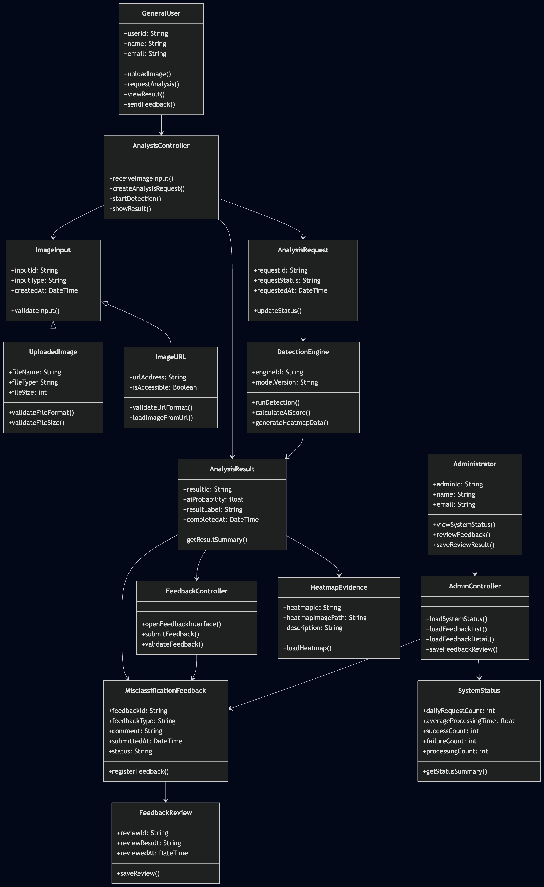
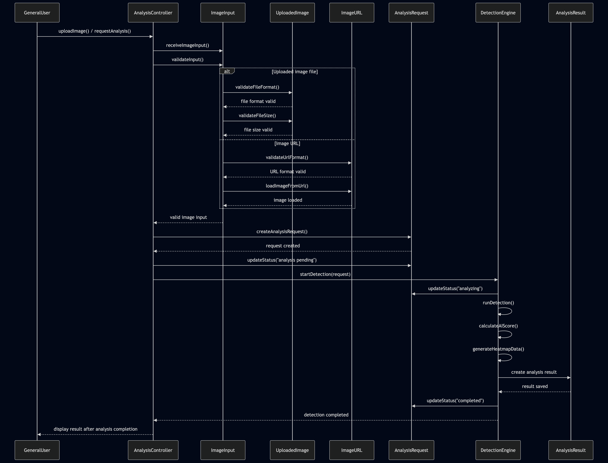
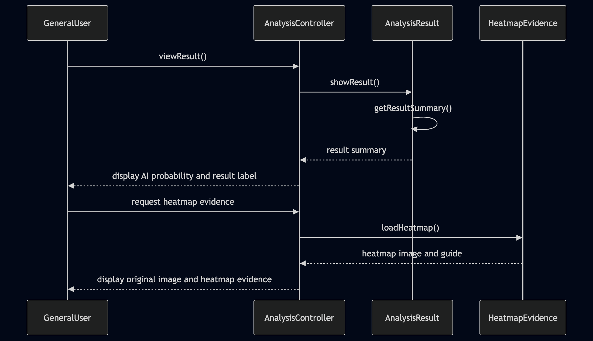
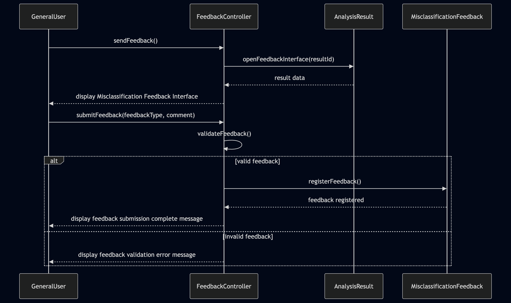
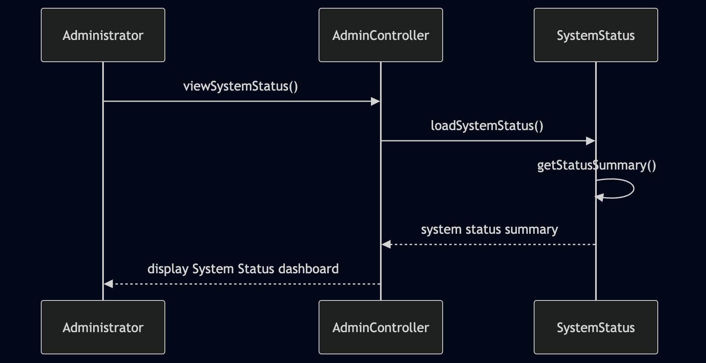
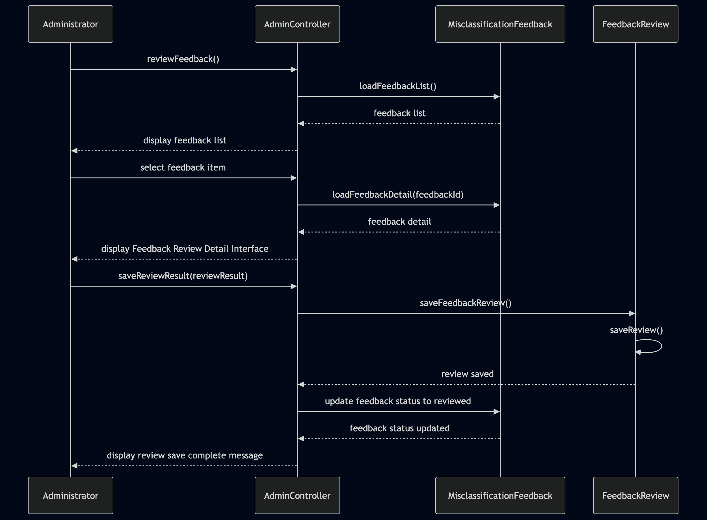
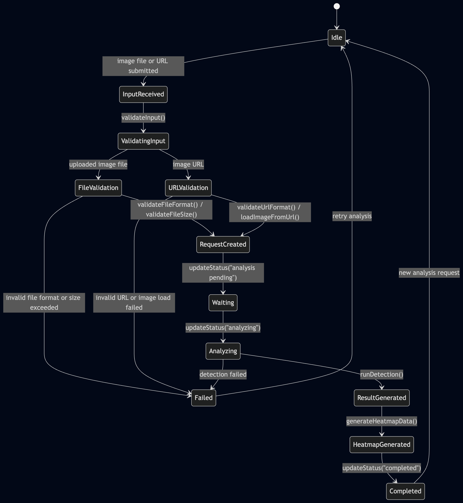
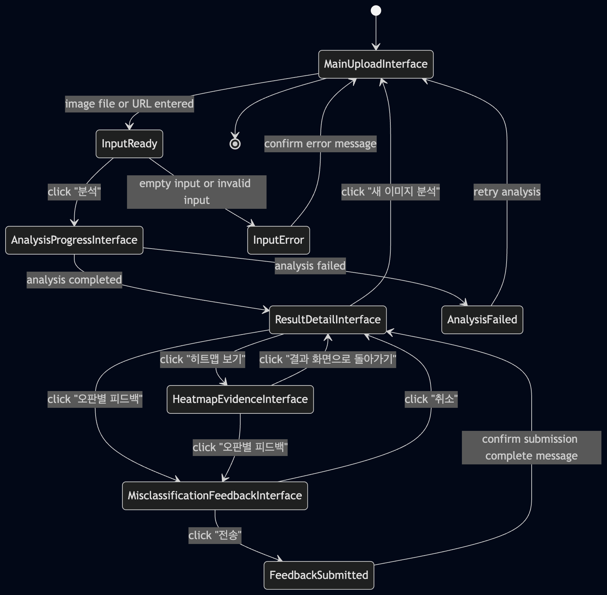
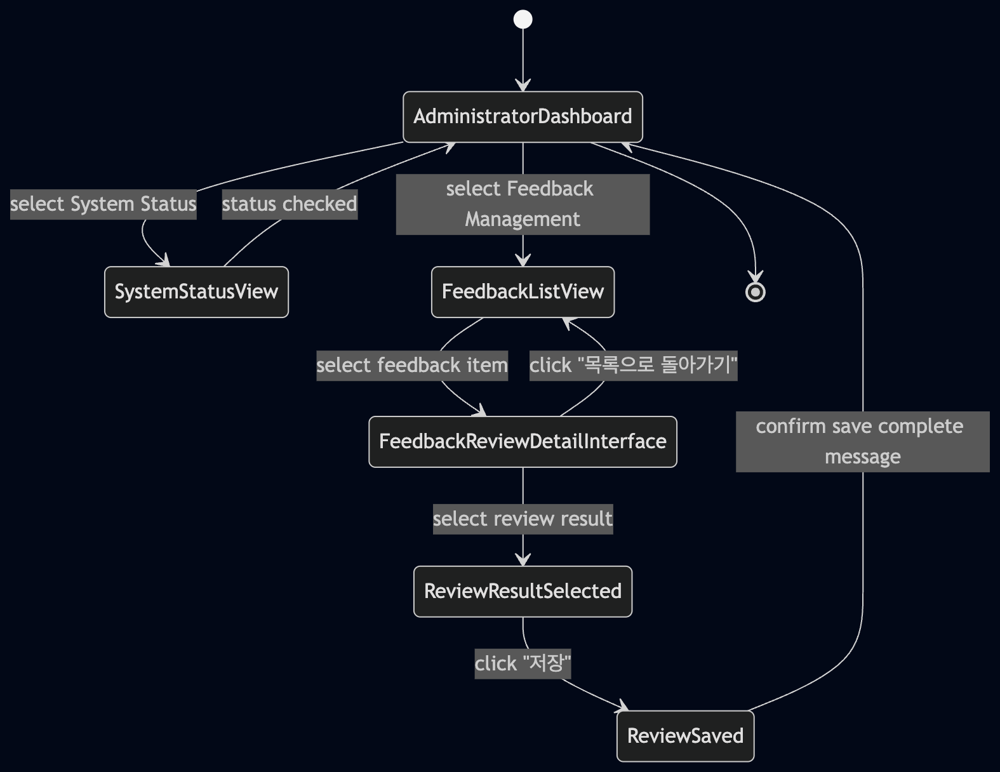

# 3. Design

## AI Image Checker
### TrueLens
### GPU 기반 AI 생성 이미지 판별 시스템

> 최종 구현 반영 메모: Design 단계에서는 GPU 기반 자체 판별 엔진을 서비스 클래스로 설계하였다. 최종 Implementation 단계에서는 Render 배포 환경의 안정성과 과제 제출용 웹 링크 운영을 고려하여 Sightengine AI Image Detection API를 호출하는 DetectionEngine으로 구현하였다. 시각 근거 화면은 API가 제공하지 않는 위치별 attention map을 대체하기 위해 로컬 이미지 패치 분석으로 경계 변화, 고주파 질감, 색상 분산, 압축 블록 경계 지표가 상대적으로 큰 영역을 보조 시각화한다.

**Student No, Name, E-mail**
- Student No: 22313526
- Name: 장지웅
- E-mail: jgo030256@gmail.com

---

## [ Revision history ]

| Revision date | Version # | Description | Author |
|---|---:|---|---|
| 06/03/2026 | 0.01 | Design document 작성 시작 | 장지웅 |
| 06/03/2026 | 0.02 | Class diagram 작성 | 장지웅 |
| 06/04/2026 | 0.03 | State diagram까지 작성 | 장지웅 |
| 06/04/2026 | 0.03 | 1차 완성 | 장지웅 |

---

## = Contents =

1. Introduction  
2. Class diagram  
3. Sequence diagram  
4. State machine diagram  
5. Implementation requirements  
6. Glossary  
7. References  

---

# 1. Introduction

## 1.1 Purpose

본 Design 문서는 AI Image Checker(TrueLens) 시스템의 설계 구조를 정의하기 위한 문서이다. 이전 Analysis 단계에서 도출한 Use Case, 주요 도메인 클래스, 사용자 인터페이스 흐름을 기반으로 시스템을 실제 구현 가능한 구조로 구체화한다. 본 문서에서는 클래스 다이어그램, 시퀀스 다이어그램, 상태 머신 다이어그램을 통해 시스템을 구성하는 주요 객체와 객체 간 상호작용, 그리고 주요 상태 변화 흐름을 설계한다.

## 1.2 System overview

AI Image Checker(TrueLens)는 사용자가 업로드한 이미지 파일 또는 이미지 URL을 분석하여 해당 이미지가 생성형 AI에 의해 만들어졌을 가능성을 판별하는 GPU 기반 이미지 검증 보조 시스템이다. 시스템은 이미지 입력, 분석 요청 생성, GPU 기반 판별, 분석 결과 제공, 히트맵 근거 확인, 오판별 피드백 제출, 관리자 검토 기능으로 구성된다.

General User는 이미지 파일 또는 URL을 입력하여 분석을 요청하고, 분석 결과 화면에서 AI 생성 확률과 판별 문구를 확인한다. 또한 히트맵 근거를 통해 의심 영역을 시각적으로 확인할 수 있으며, 결과가 실제와 다르다고 판단할 경우 오판별 피드백을 제출할 수 있다. Administrator는 관리자 대시보드를 통해 시스템 운영 상태와 피드백 목록을 확인하고, 특정 피드백의 상세 내용을 검토하여 모델 개선 후보, 단순 참고, 검토 제외 등으로 분류한다.

## 1.3 Design scope

본 Design 문서의 범위는 AI Image Checker(TrueLens)의 핵심 기능을 구현하기 위한 소프트웨어 구조 설계에 한정한다. 설계 범위에는 사용자 입력 처리, 분석 요청 관리, GPU 기반 이미지 분석 엔진 호출, 분석 결과 및 히트맵 정보 관리, 오판별 피드백 처리, 관리자 상태 조회 및 피드백 검토 기능이 포함된다.

반면 실제 AI 모델 학습 과정, 대규모 배포 환경 구성, 외부 SNS 플랫폼 연동, 동영상 딥페이크 실시간 분석 기능은 본 설계 범위에 포함하지 않는다. 본 문서는 정지 이미지 분석을 중심으로 시스템 내부 구조와 주요 객체 간 상호작용을 명확히 정의하는 것을 목표로 한다.

---

# 2. Class diagram

## 2.1 Class diagram overview

본 장에서는 AI Image Checker(TrueLens) 시스템의 주요 클래스를 정의하고, 각 클래스 간의 관계를 설계한다. Class Diagram은 Analysis 단계에서 도출한 도메인 클래스를 바탕으로 구성하였으며, 이미지 입력, 분석 요청, GPU 기반 판별, 분석 결과 생성, 히트맵 근거 제공, 오판별 피드백 제출, 관리자 검토 흐름을 중심으로 설계하였다.

본 시스템은 General User와 Administrator를 주요 사용자 클래스로 두며, 사용자의 요청을 처리하기 위해 AnalysisController, FeedbackController, AdminController를 둔다. ImageInput은 UploadedImage와 ImageURL의 상위 클래스로 설계하여 파일 업로드 방식과 URL 입력 방식을 하나의 입력 개념으로 다룰 수 있도록 하였다. AnalysisRequest는 입력된 이미지에 대한 분석 요청을 나타내며, DetectionEngine은 GPU 기반 판별 과정을 수행한다. 분석 결과는 AnalysisResult로 저장되고, 히트맵 근거는 HeatmapEvidence와 연결된다. 사용자가 판별 결과에 이의를 제기할 경우 MisclassificationFeedback이 생성되며, 관리자는 이를 FeedbackReview로 검토한다.

[그림 2-1] AI Image Checker(TrueLens) Class Diagram

## 2.2 Class list

| No. | Class Name | Type | Description |
|---|---|---|---|
| 1 | GeneralUser | Entity | 이미지 파일 또는 URL을 입력하고, 분석 결과와 히트맵을 확인하며, 오판별 피드백을 제출하는 일반 사용자 클래스이다. |
| 2 | Administrator | Entity | 시스템 운영 상태와 오판별 피드백 데이터를 관리하는 관리자 클래스이다. |
| 3 | AnalysisController | Controller | 이미지 입력 수신, 분석 요청 생성, 분석 실행 요청, 결과 화면 표시 흐름을 제어하는 클래스이다. |
| 4 | FeedbackController | Controller | General User의 오판별 피드백 입력, 검증, 제출 흐름을 제어하는 클래스이다. |
| 5 | AdminController | Controller | 관리자 대시보드에서 시스템 상태 조회, 피드백 목록 조회, 피드백 상세 검토 및 저장 흐름을 제어하는 클래스이다. |
| 6 | ImageInput | Entity | 사용자가 제출한 분석 대상 입력 정보를 나타내는 상위 클래스이다. |
| 7 | UploadedImage | Entity | 사용자가 로컬 디바이스에서 업로드한 이미지 파일 정보를 나타내는 클래스이다. |
| 8 | ImageURL | Entity | 사용자가 웹상 이미지 분석을 위해 입력한 URL 정보를 나타내는 클래스이다. |
| 9 | AnalysisRequest | Entity | 이미지 입력을 기반으로 생성되는 분석 요청 정보를 나타내는 클래스이다. |
| 10 | DetectionEngine | Service | GPU 기반 이미지 판별 기능을 수행하는 분석 엔진 클래스이다. |
| 11 | AnalysisResult | Entity | 이미지 분석 완료 후 생성되는 AI 생성 확률과 판별 결과 정보를 나타내는 클래스이다. |
| 12 | HeatmapEvidence | Entity | AI 생성 또는 조작 의심 영역을 시각적으로 설명하는 히트맵 근거 클래스이다. |
| 13 | MisclassificationFeedback | Entity | General User가 제출한 오판별 피드백 정보를 나타내는 클래스이다. |
| 14 | FeedbackReview | Entity | Administrator가 오판별 피드백을 검토한 결과를 나타내는 클래스이다. |
| 15 | SystemStatus | Entity | 일일 요청 수, 평균 처리 시간, 성공/실패 건수 등 시스템 운영 상태를 나타내는 클래스이다. |

## 2.3 Class description

### 2.3.1 GeneralUser

| Item | Description |
|---|---|
| Responsibility | 이미지 분석을 요청하고, 분석 결과와 히트맵 근거를 확인하며, 필요할 경우 오판별 피드백을 제출한다. |
| Attributes | userId, name, email |
| Methods | uploadImage(), requestAnalysis(), viewResult(), sendFeedback() |
| Related Classes | AnalysisController, FeedbackController |

GeneralUser는 AI Image Checker(TrueLens)의 일반 사용자를 나타낸다. 사용자는 이미지 파일을 업로드하거나 이미지 URL을 입력하여 분석을 요청할 수 있으며, 분석 완료 후 결과 화면에서 AI 생성 확률과 판별 문구를 확인한다. 또한 시스템의 판별 결과가 실제와 다르다고 판단하면 오판별 피드백을 제출할 수 있다.

### 2.3.2 Administrator

| Item | Description |
|---|---|
| Responsibility | 시스템 운영 상태를 확인하고, 접수된 오판별 피드백을 검토하며, 검토 결과를 저장한다. |
| Attributes | adminId, name, email |
| Methods | viewSystemStatus(), reviewFeedback(), saveReviewResult() |
| Related Classes | AdminController, SystemStatus, MisclassificationFeedback, FeedbackReview |

Administrator는 AI Image Checker(TrueLens)의 관리자 역할을 나타낸다. 관리자는 관리자 대시보드에 접근하여 일일 요청 수, 평균 처리 시간, 성공 및 실패 건수, 처리 중 요청 수 등을 확인한다. 또한 사용자가 제출한 오판별 피드백을 검토하고, 해당 피드백을 모델 개선 후보, 단순 참고, 검토 제외 등으로 분류한다.

### 2.3.3 AnalysisController

| Item | Description |
|---|---|
| Responsibility | 이미지 입력을 수신하고 분석 요청을 생성하며, 분석 엔진 실행과 결과 표시 흐름을 제어한다. |
| Attributes | 없음 |
| Methods | receiveImageInput(), createAnalysisRequest(), startDetection(), showResult() |
| Related Classes | GeneralUser, ImageInput, AnalysisRequest, DetectionEngine, AnalysisResult |

AnalysisController는 General User의 이미지 분석 요청 흐름을 제어하는 컨트롤러 클래스이다. 사용자가 파일 또는 URL을 입력하면 입력 정보를 수신하고, 이를 기반으로 AnalysisRequest를 생성한다. 이후 DetectionEngine을 통해 분석을 실행하고, 분석이 완료되면 AnalysisResult를 결과 화면에 표시하는 흐름을 담당한다.

### 2.3.4 FeedbackController

| Item | Description |
|---|---|
| Responsibility | 오판별 피드백 화면을 표시하고, 사용자가 입력한 피드백 내용을 검증한 뒤 저장 요청을 수행한다. |
| Attributes | 없음 |
| Methods | openFeedbackInterface(), submitFeedback(), validateFeedback() |
| Related Classes | AnalysisResult, MisclassificationFeedback |

FeedbackController는 General User가 분석 결과에 대해 오판별 피드백을 제출하는 흐름을 제어한다. 사용자가 Result Detail Interface에서 오판별 피드백 버튼을 클릭하면 Misclassification Feedback Interface를 표시하고, 피드백 유형과 추가 의견이 입력되었는지 확인한 뒤 MisclassificationFeedback 객체를 생성한다.

### 2.3.5 AdminController

| Item | Description |
|---|---|
| Responsibility | 관리자 대시보드에서 시스템 상태와 피드백 데이터를 불러오고, 피드백 검토 결과를 저장한다. |
| Attributes | 없음 |
| Methods | loadSystemStatus(), loadFeedbackList(), loadFeedbackDetail(), saveFeedbackReview() |
| Related Classes | Administrator, SystemStatus, MisclassificationFeedback, FeedbackReview |

AdminController는 Administrator의 관리 기능 흐름을 제어하는 컨트롤러 클래스이다. 관리자가 관리자 대시보드에 접근하면 SystemStatus 정보를 불러와 표시하고, Feedback Management 영역에서 오판별 피드백 목록과 상세 정보를 제공한다. 또한 관리자가 검토 결과를 선택하고 저장하면 FeedbackReview 정보를 저장하도록 처리한다.

### 2.3.6 ImageInput

| Item | Description |
|---|---|
| Responsibility | General User가 제출한 이미지 입력 정보를 공통 개념으로 관리한다. |
| Attributes | inputId, inputType, createdAt |
| Methods | validateInput() |
| Related Classes | UploadedImage, ImageURL, AnalysisController |

ImageInput은 사용자가 시스템에 제출한 분석 대상 입력 정보를 나타내는 상위 클래스이다. 사용자는 로컬 디바이스의 이미지 파일을 업로드하거나 웹상의 이미지 URL을 입력할 수 있으므로, ImageInput은 두 입력 방식을 하나의 공통 입력 개념으로 추상화한다. UploadedImage와 ImageURL은 ImageInput을 구체화한 하위 클래스이며, AnalysisController는 ImageInput을 기반으로 분석 요청을 생성한다.

### 2.3.7 UploadedImage

| Item | Description |
|---|---|
| Responsibility | 사용자가 로컬 디바이스에서 업로드한 이미지 파일 정보를 관리한다. |
| Attributes | fileName, fileType, fileSize |
| Methods | validateFileFormat(), validateFileSize() |
| Related Classes | ImageInput, AnalysisController |

UploadedImage는 General User가 로컬 디바이스에서 선택하거나 드래그 앤 드롭 방식으로 업로드한 이미지 파일을 나타낸다. 이 클래스는 파일명, 파일 형식, 파일 크기와 같은 정보를 가지며, 시스템은 이를 통해 지원 가능한 이미지 형식인지와 용량 제한을 초과하지 않았는지를 확인한다. 정상적인 이미지 파일로 확인되면 UploadedImage는 ImageInput의 한 유형으로 AnalysisRequest 생성에 사용된다.

### 2.3.8 ImageURL

| Item | Description |
|---|---|
| Responsibility | 사용자가 입력한 이미지 URL 정보를 관리하고 접근 가능 여부를 확인한다. |
| Attributes | urlAddress, isAccessible |
| Methods | validateUrlFormat(), loadImageFromUrl() |
| Related Classes | ImageInput, AnalysisController |

ImageURL은 General User가 웹상에 게시된 이미지를 분석하기 위해 입력한 URL 정보를 나타낸다. 이 클래스는 URL 주소와 접근 가능 여부를 속성으로 가지며, 입력된 주소가 올바른 이미지 URL 형식인지 확인한다. URL 형식이 올바르고 해당 주소에서 이미지를 불러올 수 있는 경우, ImageURL은 ImageInput의 한 유형으로 분석 요청 생성에 사용된다.

### 2.3.9 AnalysisRequest

| Item | Description |
|---|---|
| Responsibility | 사용자의 이미지 입력을 기반으로 생성된 분석 요청 정보를 관리한다. |
| Attributes | requestId, requestStatus, requestedAt |
| Methods | updateStatus() |
| Related Classes | AnalysisController, ImageInput, DetectionEngine, AnalysisResult |

AnalysisRequest는 사용자가 제출한 이미지 입력에 대해 생성되는 분석 요청 클래스이다. 이 클래스는 분석 요청 ID, 요청 상태, 요청 시간 정보를 가지며, 요청 상태는 처리 대기, 분석 중, 분석 완료, 분석 실패 등으로 변경될 수 있다. AnalysisRequest는 ImageInput과 DetectionEngine 사이에서 분석 대상과 처리 상태를 연결하는 중심 역할을 수행한다.

### 2.3.10 DetectionEngine

| Item | Description |
|---|---|
| Responsibility | 입력된 이미지의 AI 생성 가능성을 계산하고 히트맵 근거 데이터를 생성한다. |
| Attributes | engineId, modelVersion |
| Methods | runDetection(), calculateAIScore(), generateHeatmapData() |
| Related Classes | AnalysisRequest, AnalysisResult, HeatmapEvidence |

DetectionEngine은 GPU 기반 이미지 분석을 수행하는 서비스 클래스이다. AnalysisRequest로 전달된 이미지를 분석하여 AI 생성 가능성 점수를 계산하고, 이미지 내에서 AI 생성 또는 조작 가능성이 상대적으로 높은 영역을 추정하기 위한 히트맵 데이터를 생성한다. 분석이 정상적으로 완료되면 DetectionEngine은 AnalysisResult와 HeatmapEvidence 생성을 위한 핵심 데이터를 제공한다.

### 2.3.11 AnalysisResult

| Item | Description |
|---|---|
| Responsibility | 이미지 분석 완료 후 생성된 판별 결과 정보를 관리한다. |
| Attributes | resultId, aiProbability, resultLabel, completedAt |
| Methods | getResultSummary() |
| Related Classes | AnalysisController, DetectionEngine, HeatmapEvidence, FeedbackController |

AnalysisResult는 이미지 분석이 완료된 후 생성되는 결과 정보를 나타낸다. 이 클래스는 AI 생성 확률, 판별 문구, 분석 완료 시간 등을 포함하며, General User가 Result Detail Interface에서 확인하는 주요 데이터를 제공한다. 또한 AnalysisResult는 HeatmapEvidence와 연결되어 시각적 판별 근거를 제공하고, 사용자가 결과에 이의를 제기할 경우 FeedbackController를 통해 오판별 피드백 제출 흐름으로 이어진다.

### 2.3.12 HeatmapEvidence

| Item | Description |
|---|---|
| Responsibility | AI 생성 또는 조작 가능성이 높은 영역을 시각적 근거로 제공한다. |
| Attributes | heatmapId, heatmapImagePath, description |
| Methods | loadHeatmap() |
| Related Classes | AnalysisResult |

HeatmapEvidence는 AnalysisResult에 연결되는 시각적 근거 클래스이다. 이 클래스는 히트맵 이미지 경로와 설명 정보를 포함하며, General User가 원본 이미지와 히트맵 이미지를 비교할 수 있도록 한다. HeatmapEvidence는 단순한 AI 생성 확률 수치를 보완하여 사용자가 시스템의 판별 근거를 더 직관적으로 이해할 수 있게 한다.

### 2.3.13 MisclassificationFeedback

| Item | Description |
|---|---|
| Responsibility | General User가 제출한 오판별 피드백 정보를 관리한다. |
| Attributes | feedbackId, feedbackType, comment, submittedAt, status |
| Methods | registerFeedback() |
| Related Classes | FeedbackController, AnalysisResult, AdminController, FeedbackReview |

MisclassificationFeedback은 General User가 시스템의 판별 결과가 실제와 다르다고 판단할 때 제출하는 피드백 정보를 나타낸다. 이 클래스는 피드백 유형, 추가 의견, 제출 시간, 검토 상태 등을 포함한다. 제출된 피드백은 관리자 검토 대기 상태로 등록되며, AdminController를 통해 Administrator에게 제공되고 FeedbackReview 생성의 대상이 된다.

### 2.3.14 FeedbackReview

| Item | Description |
|---|---|
| Responsibility | Administrator가 오판별 피드백을 검토한 결과를 관리한다. |
| Attributes | reviewId, reviewResult, reviewedAt |
| Methods | saveReview() |
| Related Classes | MisclassificationFeedback, AdminController, Administrator |

FeedbackReview는 Administrator가 MisclassificationFeedback을 검토한 결과를 나타내는 클래스이다. 관리자는 피드백 상세 정보를 확인한 뒤 해당 피드백을 모델 개선 후보, 단순 참고, 검토 제외 중 하나로 분류할 수 있다. FeedbackReview는 피드백 검토 결과와 검토 시간을 저장하여 이후 시스템 개선 자료로 활용될 수 있도록 한다.

### 2.3.15 SystemStatus

| Item | Description |
|---|---|
| Responsibility | 시스템 운영 상태와 분석 처리 통계 정보를 관리한다. |
| Attributes | dailyRequestCount, averageProcessingTime, successCount, failureCount, processingCount |
| Methods | getStatusSummary() |
| Related Classes | AdminController, Administrator |

SystemStatus는 AI Image Checker(TrueLens)의 운영 상태 정보를 나타내는 클래스이다. 이 클래스는 일일 분석 요청 수, 평균 처리 시간, 분석 성공 건수, 분석 실패 건수, 현재 처리 중인 요청 수 등을 포함한다. Administrator는 AdminController를 통해 SystemStatus 정보를 조회하여 시스템이 정상적으로 운영되고 있는지 확인할 수 있다.

---

# 3. Sequence diagram

## 3.1 Sequence diagram overview

본 장에서는 Analysis 단계에서 정의한 Use Case 흐름을 기반으로 AI Image Checker(TrueLens) 시스템의 주요 객체 간 상호작용을 Sequence Diagram으로 설계한다. Sequence Diagram은 Class Diagram에서 정의한 클래스와 operation이 실제 기능 수행 과정에서 어떤 순서로 호출되는지를 보여준다. 본 문서에서는 모든 Use Case를 하나의 복잡한 다이어그램에 표현하지 않고, 기능 흐름에 따라 다섯 개의 Sequence Diagram으로 분리하여 설계하였다.

| No. | Sequence Diagram | Related Use Case | Covered Operations |
|---|---|---|---|
| 1 | Upload Image and Run Detection | Upload Image & Request URL Analysis, Run GPU-based Detection | uploadImage(), requestAnalysis(), receiveImageInput(), validateInput(), validateFileFormat(), validateFileSize(), validateUrlFormat(), loadImageFromUrl(), createAnalysisRequest(), updateStatus(), startDetection(), runDetection(), calculateAIScore(), generateHeatmapData() |
| 2 | View Detection Result and Heatmap Evidence | View Detection Result, View Heatmap Evidence | viewResult(), showResult(), getResultSummary(), loadHeatmap() |
| 3 | Send Misclassification Feedback | Send Misclassification Feedback | sendFeedback(), openFeedbackInterface(), validateFeedback(), submitFeedback(), registerFeedback() |
| 4 | Manage System Status | Manage System Status | viewSystemStatus(), loadSystemStatus(), getStatusSummary() |
| 5 | Review Feedback Data | Review Feedback Data | reviewFeedback(), loadFeedbackList(), loadFeedbackDetail(), saveReviewResult(), saveFeedbackReview(), saveReview() |

## 3.2 Upload Image and Run Detection Sequence

[그림 3-1] Upload Image and Run Detection Sequence Diagram

본 Sequence Diagram은 General User가 이미지 파일 또는 이미지 URL을 입력하여 분석을 요청하고, 시스템이 이를 검증한 뒤 GPU 기반 판별을 수행하는 흐름을 나타낸다. General User는 uploadImage() 또는 requestAnalysis()를 통해 AnalysisController에 분석 요청을 전달한다. AnalysisController는 ImageInput을 통해 입력값을 수신하고 validateInput()을 수행한다.

입력 방식이 업로드 이미지 파일인 경우 UploadedImage는 validateFileFormat()과 validateFileSize()를 통해 파일 형식과 용량을 확인한다. 입력 방식이 이미지 URL인 경우 ImageURL은 validateUrlFormat()과 loadImageFromUrl()을 통해 URL 형식과 이미지 로드 가능 여부를 확인한다. 입력이 정상으로 판단되면 AnalysisController는 AnalysisRequest를 생성하고, 요청 상태를 분석 대기 상태로 변경한 뒤 DetectionEngine에 분석 실행을 요청한다.

DetectionEngine은 runDetection(), calculateAIScore(), generateHeatmapData()를 수행하여 이미지의 AI 생성 가능성과 히트맵 근거 데이터를 생성한다. 분석이 완료되면 AnalysisResult가 생성되고, AnalysisRequest의 상태는 completed로 변경된다. 이후 AnalysisController는 General User에게 분석 완료 후 결과 화면을 표시할 준비를 한다.

## 3.3 View Detection Result and Heatmap Evidence Sequence

[그림 3-2] View Detection Result and Heatmap Evidence Sequence Diagram

본 Sequence Diagram은 General User가 분석 결과와 히트맵 근거를 확인하는 흐름을 나타낸다. General User가 viewResult()를 요청하면 AnalysisController는 AnalysisResult에 showResult()를 호출하여 분석 결과 정보를 가져온다. AnalysisResult는 getResultSummary()를 수행하여 AI 생성 확률, 판별 문구, 결과 요약 정보를 구성하고 이를 AnalysisController에 반환한다.

AnalysisController는 General User에게 AI 생성 확률과 판별 문구를 표시한다. 이후 General User가 히트맵 근거 확인을 요청하면 AnalysisController는 HeatmapEvidence의 loadHeatmap()을 호출한다. HeatmapEvidence는 히트맵 이미지와 안내 정보를 반환하고, AnalysisController는 원본 이미지와 히트맵 근거를 함께 표시한다.

## 3.4 Send Misclassification Feedback Sequence

[그림 3-3] Send Misclassification Feedback Sequence Diagram

본 Sequence Diagram은 General User가 시스템의 판별 결과가 실제와 다르다고 판단할 때 오판별 피드백을 제출하는 흐름을 나타낸다. General User는 sendFeedback()을 통해 FeedbackController에 피드백 제출 흐름을 요청한다. FeedbackController는 AnalysisResult에 연결된 결과 데이터를 확인한 뒤 Misclassification Feedback Interface를 표시한다.

General User는 피드백 유형과 추가 의견을 입력하고 submitFeedback()을 수행한다. FeedbackController는 validateFeedback()을 통해 피드백 유형이 선택되었는지, 입력값이 유효한지 확인한다. 피드백이 유효한 경우 MisclassificationFeedback은 registerFeedback()을 통해 피드백 정보를 등록하고, FeedbackController는 General User에게 피드백 접수 완료 메시지를 표시한다. 반대로 피드백이 유효하지 않은 경우 시스템은 피드백 검증 오류 메시지를 표시한다.

## 3.5 Manage System Status Sequence

[그림 3-4] Manage System Status Sequence Diagram

본 Sequence Diagram은 Administrator가 시스템 운영 상태를 확인하는 흐름을 나타낸다. Administrator는 viewSystemStatus()를 통해 AdminController에 시스템 상태 조회를 요청한다. AdminController는 SystemStatus에 loadSystemStatus()를 호출하여 일일 요청 수, 평균 처리 시간, 분석 성공 건수, 분석 실패 건수, 처리 중 요청 수 등의 운영 상태 정보를 불러온다.

SystemStatus는 getStatusSummary()를 수행하여 관리자 화면에 표시할 수 있는 상태 요약 정보를 구성한다. 이후 SystemStatus는 시스템 상태 요약 정보를 AdminController에 반환하고, AdminController는 Administrator에게 System Status dashboard를 표시한다.

## 3.6 Review Feedback Data Sequence

[그림 3-5] Review Feedback Data Sequence Diagram

본 Sequence Diagram은 Administrator가 General User가 제출한 오판별 피드백을 검토하고 검토 결과를 저장하는 흐름을 나타낸다. Administrator는 reviewFeedback()을 통해 AdminController에 피드백 검토 기능을 요청한다. AdminController는 MisclassificationFeedback에 loadFeedbackList()를 호출하여 접수된 피드백 목록을 가져오고, 이를 Administrator에게 표시한다.

Administrator가 특정 피드백 항목을 선택하면 AdminController는 MisclassificationFeedback에 loadFeedbackDetail(feedbackId)를 호출하여 해당 피드백의 상세 정보를 불러온다. 이후 AdminController는 Feedback Review Detail Interface를 표시하고, Administrator는 검토 결과를 선택한 뒤 saveReviewResult(reviewResult)를 수행한다.

AdminController는 FeedbackReview에 saveFeedbackReview()를 호출하고, FeedbackReview는 saveReview()를 통해 검토 결과를 저장한다. 저장이 완료되면 AdminController는 MisclassificationFeedback의 상태를 reviewed로 변경하고, Administrator에게 검토 결과 저장 완료 메시지를 표시한다.

---

# 4. State machine diagram

## 4.1 State machine diagram overview

본 장에서는 AI Image Checker(TrueLens) 시스템에서 주요 객체와 사용자 화면이 어떤 상태를 가지며, 각 이벤트에 따라 어떻게 전이되는지를 State Machine Diagram으로 설계한다. 본 문서에서는 분석 요청의 내부 처리 상태, General User의 화면 전환 상태, Administrator의 관리 화면 상태를 각각 분리하여 표현하였다.

이 중 Analysis Request State Machine Diagram은 서버 측에서 분석 요청이 처리되는 상태 변화를 나타내며, General User Client State Machine Diagram과 Administrator State Machine Diagram은 각각 일반 사용자와 관리자의 클라이언트 화면 상태 전환을 나타낸다. 따라서 본 장은 서버 시스템의 처리 상태와 클라이언트 시스템의 화면 상태를 구분하여 설계한다.

## 4.2 Analysis Request State Machine Diagram

[그림 4-1] Analysis Request State Machine Diagram

본 State Machine Diagram은 이미지 분석 요청이 생성되기 전의 대기 상태부터 입력 수신, 입력 검증, 분석 요청 생성, 분석 대기, 분석 진행, 결과 생성, 히트맵 생성, 완료 또는 실패 상태로 전이되는 흐름을 나타낸다. 사용자가 이미지 파일 또는 URL을 제출하면 시스템은 입력값을 검증하고, 파일 형식이나 URL 접근 가능 여부에 따라 정상 흐름 또는 실패 흐름으로 전이한다.

정상 입력이 확인되면 AnalysisRequest는 RequestCreated 상태가 되고, 이후 Waiting 상태와 Analyzing 상태를 거쳐 DetectionEngine의 분석 처리가 수행된다. 분석이 성공적으로 완료되면 ResultGenerated와 HeatmapGenerated 상태를 거쳐 Completed 상태가 된다. 반대로 입력 검증 실패나 분석 실패가 발생하면 Failed 상태로 전이되며, 사용자는 재시도를 통해 다시 Idle 상태로 돌아갈 수 있다.

## 4.3 General User Client State Machine Diagram

[그림 4-2] General User Client State Machine Diagram

본 State Machine Diagram은 General User가 AI Image Checker(TrueLens)를 사용하는 화면 상태 전환을 나타낸다. 사용자는 MainUploadInterface에서 이미지 파일 또는 URL을 입력하고, 입력이 준비되면 분석 버튼을 클릭하여 AnalysisProgressInterface로 이동한다. 입력값이 없거나 유효하지 않은 경우 InputError 상태로 전이되며, 오류 메시지를 확인한 뒤 다시 MainUploadInterface로 돌아간다.

분석이 완료되면 ResultDetailInterface로 전이되어 AI 생성 확률과 판별 결과를 확인할 수 있다. 이후 사용자는 HeatmapEvidenceInterface로 이동하여 히트맵 근거를 확인하거나, MisclassificationFeedbackInterface로 이동하여 오판별 피드백을 제출할 수 있다. 피드백 제출이 완료되면 FeedbackSubmitted 상태를 거쳐 다시 결과 상세 화면으로 돌아간다. 또한 사용자는 새 이미지 분석 버튼을 통해 MainUploadInterface로 돌아갈 수 있다.

## 4.4 Administrator State Machine Diagram

[그림 4-3] Administrator State Machine Diagram

본 State Machine Diagram은 Administrator가 관리자 대시보드에서 시스템 상태와 오판별 피드백을 관리하는 화면 상태 전환을 나타낸다. Administrator는 AdministratorDashboard에서 시스템 상태 메뉴를 선택하여 SystemStatusView로 이동할 수 있으며, 상태 확인을 완료하면 다시 대시보드로 돌아간다.

또한 Administrator는 Feedback Management 메뉴를 선택하여 FeedbackListView로 이동하고, 검토할 피드백 항목을 선택하면 FeedbackReviewDetailInterface로 전이된다. 상세 화면에서 검토 결과를 선택하면 ReviewResultSelected 상태가 되고, 저장 버튼을 클릭하면 ReviewSaved 상태로 전이된다. 저장 완료 메시지를 확인한 뒤 AdministratorDashboard로 돌아가며, 이 흐름을 통해 오판별 피드백 검토 과정이 완료된다.

---

# 5. Implementation requirements

## 5.1 Implementation environment

본 장에서는 AI Image Checker(TrueLens) 시스템을 구현하기 위해 필요한 주요 환경과 기술적 요구사항을 정의한다. 본 시스템은 웹 기반 인터페이스를 통해 이미지 파일 또는 이미지 URL을 입력받고, 서버 측에서 이미지 분석 요청을 처리한 뒤 AI 생성 가능성, 판별 문구, 히트맵 근거, 오판별 피드백 관리 기능을 제공하는 구조로 구현된다.

| Category | Requirement |
|---|---|
| Client Environment | Chrome, Edge, Safari 등 최신 웹 브라우저에서 동작할 수 있어야 한다. |
| Frontend | HTML, CSS, JavaScript 기반의 사용자 인터페이스를 구현한다. |
| Backend | 이미지 분석 요청, 결과 조회, 피드백 저장, 관리자 조회 기능을 처리할 수 있는 서버 구조가 필요하다. |
| AI Analysis Engine | 입력 이미지를 분석하여 AI 생성 가능성 점수와 히트맵 근거 데이터를 생성할 수 있어야 한다. |
| Database | 분석 요청, 분석 결과, 히트맵 경로, 오판별 피드백, 관리자 검토 결과, 시스템 상태 데이터를 저장할 수 있어야 한다. |
| Storage | 업로드 이미지, URL 기반 이미지 사본, 히트맵 이미지 파일을 저장하고 관리할 수 있어야 한다. |
| Administrator Environment | 관리자 대시보드에서 시스템 상태와 피드백 검토 데이터를 확인할 수 있어야 한다. |

## 5.2 Functional implementation requirements

AI Image Checker(TrueLens)는 Analysis 단계에서 정의한 Use Case와 Design 단계에서 설계한 Class Diagram, Sequence Diagram, State Machine Diagram을 기반으로 다음 기능을 구현해야 한다.

| No. | Function | Implementation Requirement |
|---|---|---|
| 1 | Image input | General User는 이미지 파일을 업로드하거나 이미지 URL을 입력할 수 있어야 한다. |
| 2 | Input validation | 시스템은 입력값이 비어 있는지, 파일 형식이 지원 가능한지, 파일 용량이 제한을 초과하지 않는지, URL 형식이 올바른지 확인해야 한다. |
| 3 | Analysis request creation | 유효한 이미지 입력이 확인되면 시스템은 AnalysisRequest를 생성하고 요청 상태를 관리해야 한다. |
| 4 | AI image detection | DetectionEngine은 입력 이미지를 분석하여 AI 생성 가능성 점수를 계산해야 한다. |
| 5 | Heatmap evidence generation | DetectionEngine은 AI 생성 또는 조작 가능성이 높은 영역을 히트맵 근거 데이터로 생성해야 한다. |
| 6 | Result display | 시스템은 AI 생성 확률, 판별 문구, 결과 요약 정보를 Result Detail Interface에 표시해야 한다. |
| 7 | Heatmap display | 시스템은 원본 이미지와 히트맵 이미지를 나란히 표시하고, 히트맵 안내 문구를 제공해야 한다. |
| 8 | Misclassification feedback | General User는 분석 결과가 실제와 다르다고 판단할 경우 피드백 유형과 추가 의견을 입력하여 오판별 피드백을 제출할 수 있어야 한다. |
| 9 | System status management | Administrator는 일일 요청 수, 평균 처리 시간, 성공 건수, 실패 건수, 처리 중 요청 수, 시스템 상태를 확인할 수 있어야 한다. |
| 10 | Feedback review | Administrator는 접수된 오판별 피드백 목록과 상세 정보를 확인하고, 검토 결과를 저장할 수 있어야 한다. |

## 5.3 Non-functional implementation requirements

본 시스템은 이미지 분석 결과의 신뢰성과 사용자 경험을 보장하기 위해 다음과 같은 비기능 요구사항을 만족해야 한다.

| Category | Requirement |
|---|---|
| Performance | 일반적인 이미지 1장에 대한 분석 결과는 가능한 한 짧은 시간 안에 생성되어야 하며, 최대 5분을 넘지 않도록 한다. |
| Reliability | 분석 요청 처리 중 오류가 발생하더라도 시스템은 비정상 종료되지 않고 실패 상태와 원인을 기록해야 한다. |
| Usability | General User는 이미지 업로드, URL 입력, 결과 확인, 히트맵 확인, 피드백 제출 흐름을 직관적으로 수행할 수 있어야 한다. |
| Maintainability | DetectionEngine, Controller, Entity 클래스를 분리하여 향후 AI 모델 교체, 피드백 관리 기능 확장, 관리자 기능 개선이 가능하도록 한다. |
| Security | 업로드 파일과 URL 입력값은 악성 파일 또는 잘못된 외부 요청을 방지하기 위해 기본적인 검증 과정을 거쳐야 한다. |
| Scalability | 여러 사용자의 분석 요청이 동시에 발생할 수 있으므로 요청 상태를 구분하여 처리할 수 있어야 한다. |
| Compatibility | 주요 데스크톱 웹 브라우저에서 동일한 화면 구성과 기본 기능을 사용할 수 있어야 한다. |

## 5.4 Data management requirements

AI Image Checker(TrueLens)는 분석 요청과 결과, 피드백 검토 데이터를 지속적으로 관리해야 하므로 다음과 같은 데이터 관리 요구사항을 가진다.

| Data | Management Requirement |
|---|---|
| ImageInput | 업로드 파일 또는 URL 입력 방식, 입력 시간, 입력 유형을 관리해야 한다. |
| AnalysisRequest | 요청 ID, 요청 상태, 요청 시간, 분석 진행 상태를 관리해야 한다. |
| AnalysisResult | AI 생성 확률, 판별 문구, 완료 시간, 결과 요약 정보를 저장해야 한다. |
| HeatmapEvidence | 히트맵 이미지 경로와 히트맵 설명 정보를 저장해야 한다. |
| MisclassificationFeedback | 피드백 유형, 추가 의견, 제출 시간, 검토 상태를 저장해야 한다. |
| FeedbackReview | 관리자 검토 결과, 검토 시간, 검토 분류 정보를 저장해야 한다. |
| SystemStatus | 일일 요청 수, 평균 처리 시간, 성공 건수, 실패 건수, 처리 중 요청 수를 관리해야 한다. |

## 5.5 Implementation constraints

본 시스템을 구현할 때 적용되는 주요 제약사항은 다음과 같다.

| Constraint | Description |
|---|---|
| Image type | 본 시스템은 JPG, PNG 등 일반적인 정지 이미지 형식을 대상으로 한다. |
| File size | 업로드 가능한 이미지 파일의 최대 용량은 10MB 이하로 제한한다. |
| Analysis scope | 본 시스템은 정지 이미지 분석만 대상으로 하며, 동영상 프레임 분석이나 실시간 스트리밍 분석은 포함하지 않는다. |
| Result interpretation | AI 생성 확률과 히트맵은 최종 판정이 아니라 사용자의 판단을 돕기 위한 참고 정보로 제공된다. |
| Model improvement | 오판별 피드백은 향후 모델 개선 자료로 활용될 수 있으나, 본 Design 범위에서는 실제 모델 재학습 과정은 포함하지 않는다. |

---

# 6. Glossary

본 장에서는 AI Image Checker(TrueLens) Design 문서에서 사용된 주요 용어를 정의한다. 용어 정의는 Class Diagram, Sequence Diagram, State Machine Diagram, Implementation Requirements에서 반복적으로 사용되는 설계 개념을 중심으로 작성하였다.

| Term | Description |
|---|---|
| AI Image Checker | 사용자가 업로드한 이미지 파일 또는 이미지 URL을 분석하여 AI 생성 가능성을 판별하는 이미지 검증 보조 시스템이다. |
| TrueLens | AI Image Checker 시스템의 서비스명이다. 이미지의 진위 여부를 보다 명확하게 확인한다는 의미를 가진다. |
| General User | 이미지 파일 또는 URL을 입력하여 분석을 요청하고, 분석 결과와 히트맵 근거를 확인하며, 오판별 피드백을 제출할 수 있는 일반 사용자이다. |
| Administrator | 시스템 운영 상태를 확인하고, General User가 제출한 오판별 피드백을 검토하는 관리자이다. |
| Class Diagram | 시스템을 구성하는 주요 클래스, 속성, 메서드, 클래스 간 관계를 표현하는 UML 구조 다이어그램이다. |
| Sequence Diagram | Use Case 수행 과정에서 객체들이 어떤 순서로 메시지를 주고받는지 표현하는 UML 상호작용 다이어그램이다. |
| State Machine Diagram | 객체나 화면이 가질 수 있는 상태와 이벤트에 따른 상태 전이를 표현하는 UML 행위 다이어그램이다. |
| Controller | 사용자 요청을 받아 관련 Entity 또는 Service 객체를 호출하고 기능 흐름을 제어하는 설계 클래스이다. |
| Entity | 시스템에서 관리해야 하는 주요 데이터와 상태를 표현하는 클래스이다. |
| Service | 특정 처리 기능을 수행하는 클래스이다. 본 문서에서는 DetectionEngine이 GPU 기반 이미지 분석을 수행하는 Service 역할을 가진다. |
| ImageInput | General User가 분석 대상으로 제출한 입력 정보를 나타내는 상위 클래스이다. UploadedImage와 ImageURL의 공통 개념이다. |
| UploadedImage | General User가 로컬 디바이스에서 선택하거나 드래그 앤 드롭 방식으로 업로드한 이미지 파일 정보를 나타내는 클래스이다. |
| ImageURL | 웹상에 게시된 이미지를 분석하기 위해 General User가 입력한 이미지 주소 정보를 나타내는 클래스이다. |
| AnalysisRequest | 이미지 입력을 기반으로 생성되는 분석 요청 객체이다. 요청 ID, 요청 상태, 요청 시간 등을 포함한다. |
| DetectionEngine | 입력 이미지를 분석하여 AI 생성 가능성 점수와 히트맵 근거 데이터를 생성하는 GPU 기반 분석 엔진 클래스이다. |
| AnalysisResult | 이미지 분석 완료 후 생성되는 결과 객체이다. AI 생성 확률, 판별 문구, 분석 완료 시간 등을 포함한다. |
| HeatmapEvidence | AI 생성 또는 조작 가능성이 상대적으로 높게 탐지된 영역을 시각적으로 보여주는 히트맵 근거 객체이다. |
| MisclassificationFeedback | General User가 시스템의 판별 결과가 실제와 다르다고 판단할 때 제출하는 오판별 피드백 객체이다. |
| FeedbackReview | Administrator가 오판별 피드백을 검토한 결과를 저장하는 객체이다. |
| SystemStatus | 일일 요청 수, 평균 처리 시간, 분석 성공 건수, 분석 실패 건수, 처리 중 요청 수 등 시스템 운영 상태를 나타내는 객체이다. |
| AI-generated Image | 생성형 AI 모델에 의해 만들어졌거나 합성된 이미지이다. |
| AI Probability | 분석된 이미지가 AI로 생성되었을 가능성을 백분율 형태로 나타낸 값이다. |
| Result Label | AI 생성 확률을 바탕으로 사용자에게 제공되는 판별 문구이다. 예를 들어 “AI 생성 가능성 높음”과 같은 표현이 이에 해당한다. |
| Heatmap | 이미지 내에서 AI 생성 또는 조작 가능성이 높게 탐지된 영역을 색상으로 시각화한 결과이다. |
| Feedback Type | General User가 오판별 피드백을 제출할 때 선택하는 피드백 유형이다. 예를 들어 “실제 사진입니다”, “AI 생성 이미지입니다”가 이에 해당한다. |
| Review Result | Administrator가 피드백을 검토한 뒤 선택하는 분류 결과이다. 모델 개선 후보, 단순 참고, 검토 제외 등이 이에 해당한다. |
| Request Status | AnalysisRequest의 현재 처리 상태를 의미한다. 분석 대기, 분석 중, 완료, 실패 등의 상태로 구분된다. |
| Client State | General User 또는 Administrator가 사용하는 화면의 현재 상태를 의미한다. 예를 들어 MainUploadInterface, ResultDetailInterface, AdministratorDashboard 등이 이에 해당한다. |
| Implementation Requirement | 설계된 시스템을 실제로 구현하기 위해 필요한 기능, 환경, 성능, 데이터 관리, 제약사항에 대한 요구사항이다. |
| Non-functional Requirement | 성능, 신뢰성, 사용성, 유지보수성, 보안성, 확장성 등 시스템 품질과 관련된 요구사항이다. |

---

# 7. References

1. StarUML Documentation, “Class Diagram.”  
   https://docs.staruml.io/working-with-uml-diagrams/class-diagram

2. StarUML Documentation, “Sequence Diagram.”  
   https://docs.staruml.io/working-with-uml-diagrams/sequence-diagram

3. StarUML Documentation, “Statechart Diagram.”  
   https://docs.staruml.io/working-with-uml-diagrams/statechart-diagram

4. Mermaid Documentation, “Class diagrams.”  
   https://mermaid.js.org/syntax/classDiagram.html

5. Mermaid Documentation, “Sequence diagrams.”  
   https://mermaid.js.org/syntax/sequenceDiagram.html

6. Mermaid Documentation, “State diagrams.”  
   https://mermaid.js.org/syntax/stateDiagram.html

7. Fowler, M. (2003). *UML Distilled: A Brief Guide to the Standard Object Modeling Language*. Addison-Wesley.

8. Jacobson, I., Booch, G., & Rumbaugh, J. (1999). *The Unified Software Development Process*. Addison-Wesley.

9. NVIDIA Developer, “CUDA Toolkit Documentation.”  
   https://docs.nvidia.com/cuda/

10. PyTorch Documentation, “CUDA semantics.”  
    https://docs.pytorch.org/docs/stable/notes/cuda.html

11. OpenCV Documentation, “Image Processing in OpenCV.”  
    https://docs.opencv.org/

12. Selvaraju, R. R., Cogswell, M., Das, A., Vedantam, R., Parikh, D., & Batra, D. (2017). “Grad-CAM: Visual Explanations from Deep Networks via Gradient-based Localization.” *Proceedings of the IEEE International Conference on Computer Vision (ICCV)*.

13. GitHub Docs, “Basic writing and formatting syntax.”  
    https://docs.github.com/github/writing-on-github/getting-started-with-writing-and-formatting-on-github/basic-writing-and-formatting-syntax
