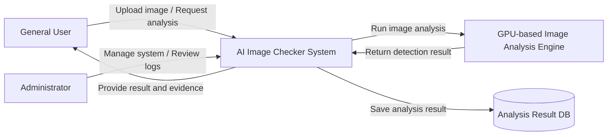

# 1. Conceptualization

## AI Image Checker
### GPU-based AI Image Verification Assistant
### GPU 기반 AI 생성 이미지 판별 시스템

**Student No, Name, E-mail**
- Student No: 22313526
- Name: 장지웅
- E-mail: jgo030256@gmail.com

---

## [ Revision history ]

| Revision date | Version # | Description | Author |
|---|---:|---|---|
| 03/26/2026 | 0.01 | Conceptualization 작성 | 장지웅 |
| 03/27/2026 | 0.02 | Diagram 부분까지 작성 | 장지웅 |

---

## = Contents =

1. Business purpose  
2. System context diagram  
3. Use case list  
4. Concept of operation  
5. Problem statement  
6. Glossary  
7. References  

---

# 1. Business purpose

## 1) Project background

최근 생성형 AI 기술의 급속한 발전으로 인해 일반 사용자도 매우 정교한 합성 이미지를 쉽게 생성할 수 있게 되었다. 이러한 기술은 창작, 디자인, 교육 등 다양한 분야에서 긍정적으로 활용될 수 있지만, 반대로 허위 정보 유포, 사칭, 가짜 증거 이미지 생성, 온라인 여론 조작 등 여러 부정적 문제를 함께 발생시키고 있다. 특히 SNS, 커뮤니티, 메신저를 통해 이미지가 빠르게 확산되는 환경에서는 사용자가 이미지를 직접 보고도 진위 여부를 판단하기 어려운 경우가 많다.

기존의 텍스트 중심 허위정보 판별과 달리 이미지 기반 허위정보는 시각적 설득력이 강하고 재가공도 쉬워 피해가 더 크게 확산될 수 있다. 또한 이미지 편집 도구와 생성형 모델이 계속 발전하면서 사람의 직관만으로 진위를 구별하는 것은 점점 더 어려워지고 있다. 따라서 사용자가 이미지를 업로드하면 AI 생성 의심 여부와 함께 판별 근거를 제공하는 검증 보조 시스템이 필요하다.

본 프로젝트는 이러한 문제의식에서 출발하여, 사용자가 업로드한 이미지가 실제 촬영 이미지인지 또는 AI 생성 이미지일 가능성이 높은지를 분석해 주는 시스템을 기획한다. 특히 딥러닝 기반 이미지 분석 모델의 추론 과정에 GPU를 활용하여 분석 속도를 높이고, 추후 대량 이미지 처리나 실시간 서비스로 확장 가능한 구조를 목표로 한다.

## 2) Motivation

본 프로젝트의 핵심 동기는 다음과 같다.

- 생성형 AI 이미지의 확산으로 인해 디지털 신뢰성이 약화되고 있다.
- 일반 사용자는 이미지의 진위를 스스로 판단하기 어렵다.
- 기존의 단순 검색 방식만으로는 합성 이미지 여부를 충분히 확인하기 어렵다.
- 이미지 판별 모델은 연산량이 크므로 GPU 활용이 자연스럽고, 컴퓨터공학 프로젝트로서 기술적 확장성도 높다.

## 3) Goal

본 프로젝트의 목표는 다음과 같다.

- 사용자가 업로드한 이미지를 분석하여 AI 생성 이미지 의심 여부를 제시한다.
- 단순히 “가짜/진짜”만 출력하는 것이 아니라 판별 근거를 함께 제공한다.
- GPU 기반 추론을 통해 빠른 분석 속도와 확장 가능성을 확보한다.
- 향후 커뮤니티, SNS 검증 보조 도구 등으로 확장 가능한 기반 시스템을 설계한다.

## 4) Target users / Target market

### Target users
- 온라인 이미지의 진위 여부를 빠르게 확인하고 싶은 일반 사용자
- 커뮤니티, SNS 유저, 운영자 또는 관리자
- 디지털 콘텐츠의 신뢰성을 검토해야 하는 학생 및 연구자
- 허위 이미지 확산을 줄이고 싶은 기관 또는 단체

### Target market
- 온라인 커뮤니티 및 SNS 보조 검증 서비스
- 교육기관 및 대학 내 디지털 리터러시 도구
- 뉴스/콘텐츠 검증 보조 시스템
- 이미지 진위 판별이 필요한 보안 및 포렌식 보조 영역

---

# 2. System context diagram

## 1) Context diagram

## 2) Description of terms in the diagram

- **General User**: 이미지를 업로드하고 판별 결과를 확인하는 사용자
- **Administrator**: 시스템 로그, 분석 요청 이력, 운영 상태를 관리하는 관리자
- **AI Image Checker System**: 이미지 업로드, 분석 요청, 결과 제공을 통합적으로 처리하는 핵심 시스템
- **GPU-based Image Analysis Engine**: 업로드된 이미지의 AI 생성 여부를 분석하는 엔진
- **Analysis Result DB**: 판별 결과, 분석 기록, 요청 이력 등을 저장하는 데이터베이스
