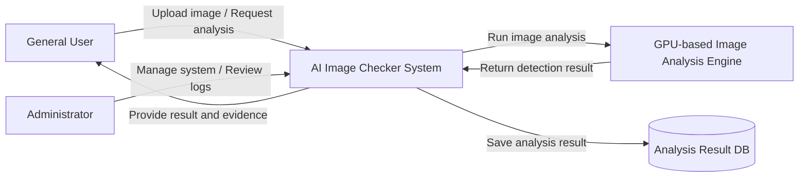

# 1. Conceptualization

## AI Image Checker
### GPU-based AI Image Verification Assistant
### GPU 기반 AI 생성 이미지 판별 시스템

**Student No, Name, E-mail**
- Student No: 22313526
- Name: 장지웅
- E-mail: jgo030256@gmail.com

## [ Revision history ]

| Revision date | Version # | Description | Author |
|---|---:|---|---|
| 03/26/2026 | 0.01 | Conceptualization 작성 | 장지웅 |
| 03/27/2026 | 0.02 | Diagram 부분까지 작성 | 장지웅 |
| 03/27/2026 | 0.03 | write Use case list, Concept of operation | 장지웅 |
| 03/27/2026 | 0.04 | write Problem statement, Glossary, References | 장지웅 |

## = Contents =

1. Business purpose  
2. System context diagram  
3. Use case list  
4. Concept of operation  
5. Problem statement  
6. Glossary  
7. References  

---

# 1. Business purpose

## 1) Project background

최근 생성형 AI 기술의 급속한 발전으로 인해 일반 사용자도 매우 정교한 합성 이미지를 쉽게 생성할 수 있게 되었다. 이러한 기술은 창작, 디자인, 교육 등 다양한 분야에서 긍정적으로 활용될 수 있지만, 반대로 허위 정보 유포, 사칭, 가짜 증거 이미지 생성, 온라인 여론 조작 등 여러 부정적 문제를 함께 발생시키고 있다. 특히 SNS, 커뮤니티, 메신저를 통해 이미지가 빠르게 확산되는 환경에서는 사용자가 이미지를 직접 보고도 진위 여부를 판단하기 어려운 경우가 많다.

기존의 텍스트 중심 허위정보 판별과 달리 이미지 기반 허위정보는 시각적 설득력이 강하고 재가공도 쉬워 피해가 더 크게 확산될 수 있다. 또한 이미지 편집 도구와 생성형 모델이 계속 발전하면서 사람의 직관만으로 진위를 구별하는 것은 점점 더 어려워지고 있다. 따라서 사용자가 이미지를 업로드하면 AI 생성 의심 여부와 함께 판별 근거를 제공하는 검증 보조 시스템이 필요하다.

본 프로젝트는 이러한 문제의식에서 출발하여, 사용자가 업로드한 이미지가 실제 촬영 이미지인지 또는 AI 생성 이미지일 가능성이 높은지를 분석해 주는 시스템을 기획한다. 특히 딥러닝 기반 이미지 분석 모델의 추론 과정에 GPU를 활용하여 분석 속도를 높이고, 추후 대량 이미지 처리나 실시간 서비스로 확장 가능한 구조를 목표로 한다.

## 2) Motivation

본 프로젝트의 핵심 동기는 다음과 같다.

- 생성형 AI 이미지의 확산으로 인해 디지털 신뢰성이 약화되고 있다.
- 일반 사용자는 이미지의 진위를 스스로 판단하기 어렵다.
- 기존의 단순 검색 방식만으로는 합성 이미지 여부를 충분히 확인하기 어렵다.
- 이미지 판별 모델은 연산량이 크므로 GPU 활용이 자연스럽고, 컴퓨터공학 프로젝트로서 기술적 확장성도 높다.

## 3) Goal

본 프로젝트의 목표는 다음과 같다.

- 사용자가 업로드한 이미지를 분석하여 AI 생성 이미지 의심 여부를 제시한다.
- 단순히 “가짜/진짜”만 출력하는 것이 아니라 판별 근거를 함께 제공한다.
- GPU 기반 추론을 통해 빠른 분석 속도와 확장 가능성을 확보한다.
- 향후 커뮤니티, SNS 검증 보조 도구 등으로 확장 가능한 기반 시스템을 설계한다.

## 4) Target users / Target market

### Target users
- 온라인 이미지의 진위 여부를 빠르게 확인하고 싶은 일반 사용자
- 커뮤니티, SNS 유저, 운영자 또는 관리자
- 디지털 콘텐츠의 신뢰성을 검토해야 하는 학생 및 연구자
- 허위 이미지 확산을 줄이고 싶은 기관 또는 단체

### Target market
- 온라인 커뮤니티 및 SNS 보조 검증 서비스
- 교육기관 및 대학 내 디지털 리터러시 도구
- 뉴스/콘텐츠 검증 보조 시스템
- 이미지 진위 판별이 필요한 보안 및 포렌식 보조 영역

---

# 2. System context diagram

## 1) Context diagram

## 2) Description of terms in the diagram

- **General User**: 이미지를 업로드하고 판별 결과를 확인하는 사용자
- **Administrator**: 시스템 로그, 분석 요청 이력, 운영 상태를 관리하는 관리자
- **AI Image Checker System**: 이미지 업로드, 분석 요청, 결과 제공을 통합적으로 처리하는 핵심 시스템
- **GPU-based Image Analysis Engine**: GPU를 활용하여 업로드된 이미지의 AI 생성 여부를 분석하는 엔진
- **Analysis Result DB**: 판별 결과, 분석 기록, 요청 이력 등을 저장하는 데이터베이스

---

# 3. Use case list

| No. | Use case | Actor | Description |
|---|---|---|---|
| 1 | Upload Image | General User | 사용자가 판별이 필요한 이미지를 시스템에 업로드한다. |
| 2 | Request Image Analysis | General User | 업로드한 이미지에 대해 AI 생성 여부 분석을 요청한다. |
| 3 | View Detection Result | General User | 시스템이 제공한 판별 결과와 AI 생성 의심 정도를 확인한다. |
| 4 | View Evidence Summary | General User | 판별 결과와 함께 제공되는 근거 요약 정보를 확인한다. |
| 5 | Save Analysis Result | General User | 분석 결과를 저장하거나 나중에 다시 확인할 수 있도록 보관한다. |
| 6 | Manage System Logs | Administrator | 시스템 운영 상태, 분석 요청 이력, 로그를 관리한다. |
| 7 | Review Analysis Records | Administrator | 저장된 분석 결과와 주요 사례를 검토한다. |

---

# 4. Concept of operation

## 1) Upload Image

| Item | Description |
|---|---|
| Purpose | 사용자가 분석이 필요한 이미지를 시스템에 입력하기 위함 |
| Approach | 사용자는 웹 인터페이스를 통해 이미지 파일을 선택하고 업로드한다. 시스템은 파일 형식과 기본 유효성을 확인한 뒤 분석 가능한 상태로 저장한다. |
| Dynamics | 사용자가 AI 생성 여부를 확인하고 싶은 이미지를 제출하는 경우 |
| Goals | 분석 가능한 이미지를 안정적으로 수집하고 다음 분석 단계로 전달한다. |

## 2) Request Image Analysis

| Item | Description |
|---|---|
| Purpose | 업로드된 이미지에 대해 AI 생성 이미지 여부 분석을 수행하기 위함 |
| Approach | 사용자가 분석 요청을 실행하면 시스템은 이미지를 전처리한 뒤 GPU-based Image Analysis Engine으로 전달한다. 분석 엔진은 이미지 특징을 기반으로 AI 생성 가능성을 추론하고 결과를 반환한다. |
| Dynamics | 업로드가 정상적으로 완료된 뒤 사용자가 분석 실행을 요청하는 경우 |
| Goals | 이미지에 대한 판별 결과와 AI 생성 의심 정도를 산출한다. |

## 3) View Detection Result

| Item | Description |
|---|---|
| Purpose | 사용자가 판별 결과를 직관적으로 이해하기 위함 |
| Approach | 시스템은 분석 결과를 점수, 등급, 또는 간단한 판단 문장 형태로 제공한다. 예를 들어 AI 생성 가능성을 낮음, 보통, 높음과 같은 형태로 표현할 수 있다. |
| Dynamics | 분석 엔진의 처리가 완료된 경우 |
| Goals | 사용자가 결과를 빠르게 확인하고 후속 판단에 활용할 수 있도록 한다. |

## 4) View Evidence Summary

| Item | Description |
|---|---|
| Purpose | 사용자가 결과의 근거를 함께 확인할 수 있도록 하기 위함 |
| Approach | 시스템은 이미지 분석 과정에서 확인된 주요 특징이나 판단 근거를 요약하여 제공한다. 이를 통해 사용자는 단순 결과뿐 아니라 왜 그런 결과가 나왔는지도 함께 이해할 수 있다. |
| Dynamics | 사용자가 판별 결과에 대한 설명이나 근거를 확인하려는 경우 |
| Goals | 결과의 신뢰성과 설명 가능성을 높인다. |

## 5) Save Analysis Result

| Item | Description |
|---|---|
| Purpose | 사용자가 분석 결과를 저장하고 다시 확인할 수 있도록 하기 위함 |
| Approach | 분석이 완료된 결과는 Analysis Result DB에 저장되며, 사용자는 이후 동일 결과를 다시 조회할 수 있다. |
| Dynamics | 사용자가 분석 결과를 기록으로 남기고자 하는 경우 |
| Goals | 결과 보관과 재사용이 가능하도록 지원한다. |

## 6) Manage System Logs

| Item | Description |
|---|---|
| Purpose | 관리자가 시스템 운영 상태를 점검하고 유지하기 위함 |
| Approach | 관리자는 시스템 로그, 요청 이력, 처리 상태 등을 확인하여 오류나 비정상 동작을 점검한다. |
| Dynamics | 시스템 운영 중 점검, 유지보수, 이상 상황 확인이 필요한 경우 |
| Goals | 시스템의 안정성과 운영 효율성을 확보한다. |

## 7) Review Analysis Records

| Item | Description |
|---|---|
| Purpose | 관리자가 저장된 분석 결과와 주요 사례를 검토하기 위함 |
| Approach | 관리자는 누적된 분석 기록을 확인하여 반복적인 오류, 특징적인 사례, 또는 개선이 필요한 영역을 파악한다. |
| Dynamics | 분석 결과 품질 점검이나 사례 검토가 필요한 경우 |
| Goals | 시스템 성능 개선과 결과 품질 관리에 활용한다. |

---

# 5. Problem statement

## 1) Overview

AI Image Checker 시스템은 사용자가 업로드한 이미지가 AI에 의해 생성되었을 가능성을 분석하고, 그 결과를 근거와 함께 제공하는 것을 목표로 한다. 그러나 이러한 시스템을 설계하고 구현하기 위해서는 단순히 이미지 분류 기능만 고려해서는 안 된다. 실제 환경에서는 분석 정확도, 처리 속도, 결과의 신뢰성, 시스템 확장성, 사용자 개인정보 보호 등 여러 요소를 함께 고려해야 한다.

특히 생성형 AI 기술은 매우 빠르게 발전하고 있으며, 새로운 이미지 생성 모델이 계속 등장하고 있다. 이에 따라 특정 모델이나 특정 데이터셋에만 잘 동작하는 탐지 방식은 실제 활용성이 떨어질 수 있다. 또한 사용자는 단순히 “AI 생성 이미지일 가능성이 높다”는 결과만으로는 시스템을 충분히 신뢰하기 어렵기 때문에, 결과에 대한 설명과 근거도 함께 제공되어야 한다. 따라서 본 시스템은 정확도뿐 아니라 설명 가능성과 운영 안정성까지 함께 고려하는 방향으로 설계되어야 한다.

## 2) Major problems to solve

### Problem #1. Difficulty in detecting newly generated AI images

생성형 AI 모델은 빠르게 발전하고 있으며, 이미지 품질도 점점 더 정교해지고 있다. 이로 인해 과거 데이터로 학습한 판별 모델은 새로운 생성 모델이 만든 이미지에 대해 성능이 저하될 수 있다. 따라서 특정 생성기만 탐지하는 방식이 아니라, 다양한 유형의 AI 생성 이미지에 대응할 수 있는 일반화 성능이 필요하다.

### Problem #2. High computational cost of image analysis

이미지 분석 모델은 많은 연산을 필요로 하며, 특히 딥러닝 기반 판별 과정은 CPU만으로 처리할 경우 속도가 느려질 수 있다. 사용자가 많아지거나 분석 요청이 동시에 들어올 경우 처리 지연이 발생할 가능성도 크다. 따라서 본 시스템은 GPU를 활용하여 이미지 분석 성능을 높이고, 안정적인 처리 속도를 유지할 수 있도록 설계할 필요가 있다.

### Problem #3. Lack of explainability in detection results

사용자는 판별 결과가 왜 그렇게 나왔는지 알 수 있어야 시스템을 신뢰할 수 있다. 그러나 단순한 분류 결과만 제시할 경우 사용자는 결과를 받아들이기 어렵고, 시스템의 설득력도 낮아질 수 있다. 따라서 본 시스템은 분석 결과와 함께 주요 판단 근거를 요약해 제공함으로써 설명 가능성을 확보해야 한다.

### Problem #4. Risk of false positives and false negatives

실제 이미지를 AI 생성 이미지로 잘못 판단하는 경우와, AI 생성 이미지를 실제 이미지로 놓치는 경우는 모두 문제가 된다. 전자는 시스템에 대한 사용자 불신을 초래할 수 있고, 후자는 허위 이미지 확산을 막지 못하게 만든다. 따라서 본 시스템은 절대적인 판정 도구가 아니라, 사용자의 판단을 돕는 보조 시스템으로 설계되어야 한다.

### Problem #5. Privacy and data management issues

사용자가 업로드하는 이미지에는 얼굴, 장소, 기기 정보 등 민감한 정보가 포함될 수 있다. 이러한 데이터가 부적절하게 저장되거나 관리될 경우 개인정보 침해 문제가 발생할 수 있다. 따라서 시스템은 저장 정책, 접근 권한, 로그 관리 등 데이터 보호 측면도 함께 고려해야 한다.

## 3) Non-functional requirements

| Category | Requirement |
|---|---|
| Performance | 시스템은 일반적인 이미지 분석 요청에 대해 짧은 시간 안에 결과를 반환할 수 있어야 한다. |
| Reliability | 손상된 이미지나 잘못된 입력이 들어와도 시스템이 비정상 종료되지 않고 안정적으로 동작해야 한다. |
| Scalability | 향후 더 많은 사용자 요청이나 기능 확장에 대응할 수 있도록 구조적으로 확장 가능해야 한다. |
| Security | 업로드된 이미지와 분석 결과는 허가된 사용자만 접근할 수 있도록 보호되어야 한다. |
| Usability | 일반 사용자도 결과를 쉽게 이해할 수 있도록 직관적인 형태로 정보를 제공해야 한다. |
| Maintainability | 분석 엔진이나 처리 로직을 수정하거나 교체하기 쉽도록 모듈화된 구조를 가져야 한다. |
| Transparency | 시스템은 결과를 절대적인 사실로 단정하지 않고, 보조 판단 정보로 제공해야 한다. |

---

# 6. Glossary

| Term | Description |
|---|---|
| AI-generated image | 생성형 AI 모델을 통해 합성되거나 생성된 이미지 |
| Authentic image | 실제 카메라 촬영 또는 현실 세계 기반으로 만들어진 원본 이미지 |
| Deepfake | 인물, 배경, 사물 등을 인위적으로 조작하거나 합성한 디지털 이미지 또는 영상 |
| GPU | 대규모 병렬 연산을 수행하여 이미지 분석 속도를 높일 수 있는 그래픽 처리 장치 |
| Inference | 학습된 AI 모델을 사용하여 새로운 입력 이미지에 대한 예측 결과를 도출하는 과정 |
| Detection result | 시스템이 이미지 분석 후 제공하는 판별 결과 |
| Detection score | 이미지가 AI 생성물일 가능성을 수치 또는 등급 형태로 나타낸 값 |
| Evidence summary | 판별 결과와 함께 제공되는 주요 분석 근거 요약 정보 |
| Metadata | 이미지 파일에 포함된 생성 시간, 장치 정보, 해상도 등의 부가 정보 |
| False positive | 실제 이미지를 AI 생성 이미지로 잘못 판별한 경우 |
| False negative | AI 생성 이미지를 실제 이미지로 잘못 판별한 경우 |
| Analysis record | 업로드된 이미지와 이에 대한 판별 결과가 저장된 기록 |
| Administrator | 시스템 로그, 요청 이력, 운영 상태를 관리하는 관리자 |
| General User | 이미지를 업로드하고 분석 결과를 확인하는 일반 사용자 |

---

# 7. References

[1] Wang, Sheng-Yu, et al. "CNN-generated images are surprisingly easy to spot... for now." Proceedings of the IEEE/CVF conference on computer vision and pattern recognition. 2020.

[2] Farid, Hany. "Image forensics." Computer Vision: A Reference Guide (2021): 619-628.

[3] PyTorch Documentation, “torch.cuda,” PyTorch Official Documentation.

[4] OpenCV Documentation, “OpenCV Image Processing,” OpenCV Official Documentation.

[5] NVIDIA Documentation, “CUDA Toolkit Documentation,” NVIDIA Developer Documentation.

[6] Hugging Face Documentation, “Image Classification,” Hugging Face Transformers Documentation.

---
